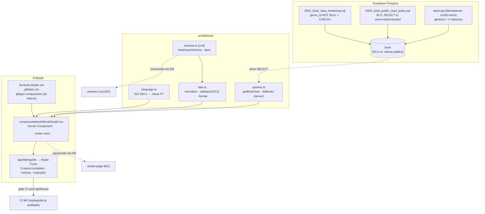

# book-data — Design

**Spec**: [spec.md](spec.md) · **Status**: Draft
**Milestone**: M1 — Núcleo de leitura pública · **Stack**: Next.js (App Router) + React + TypeScript + Tailwind v4 + Supabase
> Documentação em português; nomes de feature, schema, identificadores e código em inglês.

A tabela `book` já existe (M0). Esta feature **endurece** o schema, adiciona uma **camada de validação tipada** (zod), uma **policy de leitura pública** (RLS), um **componente de exibição acessível** e um **seed idempotente**. Não há `.specs/codebase/` (sem CONCERNS).

---

## Decisões de design confirmadas

| # | Decisão | Escolha | Resolve |
| --- | --- | --- | --- |
| DD-1 | Camada de validação | **zod** em `src/lib/book/` (mesmo padrão de [env.ts](../../../src/lib/env.ts)) como superfície primária de validação da app; **CHECK constraints** no Postgres como defesa em profundidade | Nota Specify "camada de validação"; BOOK-01/02/03/07/10 |
| DD-2 | Representação de idioma | Armazenar **código ISO 639-1** (`pt`, `fr`, `en`) em `original_language`/`translated_from`; mapa `languageLabel(code)` traduz para rótulo PT na exibição | Nota Specify "representação de idioma"; BOOK-09 |
| DD-3 | CHECK constraints (DB) | `pages > 0`; `year between 1 and 2100` (sanidade); `translator ⇒ translated_from`. A regra "ano não futuro" e o **checksum de ISBN** ficam só na app (não expressáveis como CHECK imutável) | Nota Specify "CHECK vs app"; BOOK-03/10 |
| DD-4 | Entrega do seed | **`supabase/seed.sql`** idempotente (já apontado por `config.toml` → `[db.seed]`) com **UUIDs fixos** + `on conflict (id) do nothing`; script `db:seed` aplica o mesmo arquivo ao banco **remoto/linkado** | Nota Specify "identidade estável do seed"; BOOK-15/16 |
| DD-5 | Hifenização do ISBN | Agrupamento **pragmático determinístico** (legível), **não** registration-group-accurate (exigiria as tabelas de faixa ISBN). Limitação documentada — atende "hifenizado de forma legível" | BOOK-08 |
| DD-6 | Componente de exibição | **Server Component** sem hooks (padrão do [Card](../../../src/components/ui/Card.tsx)), `<dl>/<dt>/<dd>`, classes `.lia-book-details` em `@layer components`, nível de heading do subgrupo de tradução configurável | BOOK-12/13 |
| DD-7 | Migrations | **Duas** migrations de propósito único, idempotentes com `DO`-guards: `0002` (hardening) e `0003` (policy de leitura) | BOOK-04/17 |
| DD-8 | Conjunto do seed | 4 clássicos PT (1 obra por autor) + gêneros mínimos; todos originais em português (`original_language='pt'`, sem bloco de tradução). 1–2 com ISBN de edição moderna **válido** para exercitar BOOK-05 | BOOK-16 |

---

## Architecture Overview

A ficha do livro ganha três camadas sobre a tabela existente: **dados** (migrations + seed + RLS), **validação/lógica** (zod + ISBN + idioma em `src/lib/book/`) e **exibição** (componente server + styleguide). A página de resenha (M1) e o admin (M2) consomem essas camadas.



---

## Code Reuse Analysis

### Componentes/patterns existentes a reaproveitar

| Artefato | Local | Como usar |
| --- | --- | --- |
| Padrão zod + parse | [src/lib/env.ts](../../../src/lib/env.ts) | Mesmo estilo para `bookInputSchema` (objeto + `refine`/`superRefine`). |
| Server Component apresentacional (`<dl>` análogo a `Card`) | [src/components/ui/Card.tsx](../../../src/components/ui/Card.tsx) | Copiar o padrão: sem `'use client'`, `forwardRef` opcional, helper `cx`, subcomponentes via `Object.assign` se necessário. |
| `.lia-*` em `@layer components` (só tokens) | [src/app/globals.css:210](../../../src/app/globals.css#L210) | Adicionar `.lia-book-details` ao lado de `.lia-card`/`.lia-field`. |
| Cliente Supabase tipado | [server.ts](../../../src/lib/supabase/server.ts) · [client.ts](../../../src/lib/supabase/client.ts) | `queries.ts` usa `createServerClient()`; o teste de RLS usa o client **anon** (publishable key). |
| Tipos gerados | [src/lib/database.types.ts](../../../src/lib/database.types.ts) | Regerar após `0002` (genre_id deixa de ser nullable); derivar `Book`/`BookView` de `Tables<'book'>`. |
| Página de auditoria + helpers `Section`/`Row` | [src/app/styleguide/page.tsx](../../../src/app/styleguide/page.tsx) | Adicionar uma `Section id="ficha"` com os 3 casos; já coberta pelo gate axe/Lighthouse do M0. |
| Migrations guardadas (idempotência) | [0001_core_schema.sql](../../../supabase/migrations/0001_core_schema.sql) | Mesmo estilo `DO $$ … IF (NOT) EXISTS`. |
| Mecanismo de seed | `supabase/config.toml` `[db.seed] sql_paths=["./seed.sql"]` | Criar `supabase/seed.sql` (roda no `db reset` local); `db:seed` aplica ao remoto. |

### Integration Points

| Sistema | Método |
| --- | --- |
| Supabase Postgres | `0002`/`0003` via `supabase db push` (mesmo fluxo do M0, que já está no remoto). |
| RLS / papéis | Policy `SELECT` para `anon` e `authenticated`; escrita continua sem policy (deny-by-default). `service_role` (seed/admin) contorna RLS. |
| Tipos | `supabase gen types typescript` → reescreve `database.types.ts`. |
| CI (M0) | `/styleguide` já é auditada por axe + Lighthouse; a seção Ficha entra nesse gate sem novo job. |

---

## Components

### 1. Migration `0002_book_data_hardening.sql` · BOOK-04, BOOK-03, BOOK-10

- **Purpose**: Endurecer `book` no banco.
- **Conteúdo** (idempotente, `DO`-guards):
  - `genre_id` → **NOT NULL** (guarda: só aplica se `is_nullable='YES'`; tabela vazia no pós-M0).
  - CHECK `book_pages_positive` (`pages is null or pages > 0`).
  - CHECK `book_year_sane` (`year is null or year between 1 and 2100`).
  - CHECK `book_translation_consistent` (`translator is null or translated_from is not null`).
- **Reuses**: estilo de [0001](../../../supabase/migrations/0001_core_schema.sql).
- **Done quando**: `\d book` mostra `genre_id not null` e os 3 CHECKs; inserir `book` sem gênero / `pages=0` / `year=3000` / tradutor sem idioma → rejeitado; reaplicar é no-op.

### 2. Migration `0003_book_public_read_policy.sql` · BOOK-17

- **Purpose**: Abrir leitura pública de `book` mantendo escrita fechada.
- **Conteúdo**: `create policy "book_public_read" on book for select to anon, authenticated using (true);` — guardado por `DO`/`pg_policies` (Postgres não tem `CREATE POLICY IF NOT EXISTS`). **Sem** policy de `insert/update/delete`. RLS permanece `enabled` (não tocar no `enable row level security` do M0).
- **Done quando**: client anon faz `select` em `book` e recebe linhas; `insert/update/delete` anon falham; `pg_policies` lista só a de `select`.

### 3. Tipos regerados — `src/lib/database.types.ts`

- **Purpose**: Refletir `genre_id` NOT NULL. Rodar `supabase gen types typescript` após `0002`. **Não** editar à mão.
- **Done quando**: `Tables<'book'>['genre_id']` é `string` (não `string | null`) em `Row`/`Insert` obrigatório.

### 4. ISBN — `src/lib/book/isbn.ts` · BOOK-05, BOOK-06, BOOK-08

- **Purpose**: Normalização, validação e formatação de ISBN.
- **Interfaces**:
  - `normalizeIsbn(raw: string): string` — remove tudo que não é dígito; preserva `X` final (maiúsculo) no caso de 10 caracteres.
  - `isValidIsbn10(value: string): boolean` — 10 chars, mód-11 (peso 10..1, `X`=10).
  - `isValidIsbn13(value: string): boolean` — 13 dígitos, mód-10 (pesos 1/3).
  - `isValidIsbn(value: string): boolean` — normaliza e valida 10 **ou** 13.
  - `formatIsbn(value: string): string` — hifenização pragmática (DD-5): ISBN-13 `978-DD-DDDD-DDDD-D` por comprimento de grupos fixo; ISBN-10 `D-DDD-DDDDD-D`. **Não** registration-group-accurate (documentado).
- **Dependencies**: nenhuma (puro TS).
- **Done quando**: testes unitários cobrem válidos/ inválidos, `X`, hifenizado→normalizado, e idempotência de `normalize`.

### 5. Idioma — `src/lib/book/language.ts` · BOOK-09

- **Purpose**: Mapear código ISO 639-1 → rótulo legível PT (DD-2).
- **Interfaces**: `languageLabel(code: string): string` (ex.: `pt`→"Português", `fr`→"Francês", `en`→"Inglês", `es`→"Espanhol"); fallback: retorna o próprio código se desconhecido. `LANGUAGES` (mapa) exportado para uso em formulários (M2).
- **Done quando**: `languageLabel('pt') === 'Português'`; código desconhecido não quebra a exibição.

### 6. Schema de validação — `src/lib/book/schema.ts` · BOOK-01, BOOK-02, BOOK-03, BOOK-07, BOOK-10

- **Purpose**: Contrato único de validação da ficha (app), reutilizado por seed (typecheck), testes e futuro form de admin (M2).
- **Interfaces** (zod):
  - `bookInputSchema` — objeto:
    - `title: string().trim().min(1)`, `author: string().trim().min(1)`, `genreId: string().uuid()` — **obrigatórios**.
    - `publisher`, `coverUrl(url)`, `isbn`, `originalLanguage`, `translator`, `translatedFrom` — `.optional()`.
    - `year: number().int().min(1).max(<ano corrente>)` opcional (regra "não futuro" calculada no schema).
    - `pages: number().int().positive()` opcional.
    - `.superRefine`: (a) `isbn` presente ⇒ `isValidIsbn` (senão `ctx.addIssue` com mensagem PT); (b) `translator` presente ⇒ `translatedFrom` presente.
  - `type BookInput = z.infer<typeof bookInputSchema>`.
- **Dependencies**: `zod`, `./isbn`.
- **Reuses**: padrão de [env.ts](../../../src/lib/env.ts).
- **Done quando**: ficha mínima válida; faltar gênero / `pages=0` / `year` futuro / ISBN inválido / tradutor sem origem → erro com mensagem acessível.

### 7. Acesso a dados — `src/lib/book/queries.ts` · BOOK-11 (read)

- **Purpose**: Leitura tipada da ficha (join com gênero) para a exibição.
- **Interfaces**:
  - `type BookView = Tables<'book'> & { genre: { name: string; slug: string } | null }`.
  - `getBookById(id: string): Promise<BookView | null>` e `listBooks(): Promise<BookView[]>` — `createServerClient().from('book').select('*, genre(name, slug)')`.
- **Dependencies**: `@/lib/supabase/server`, `database.types`.
- **Done quando**: `select` retorna o gênero embutido; tipos batem sem `any`.

### 8. Exibição — `src/components/book/BookDetails.tsx` · BOOK-12, BOOK-13

- **Purpose**: Renderizar a ficha com marcação semântica (DD-6).
- **Interfaces**: `BookDetails({ book, headingLevel = 3 }: { book: BookView; headingLevel?: 2|3|4 })`.
  - Estrutura: `<dl className="lia-book-details">` com pares **somente para campos presentes** (omite nulos — BOOK-12 AC#2): Autor, Gênero (de `book.genre?.name`), Editora, Ano, Páginas, Idioma original (`languageLabel`), ISBN (`formatIsbn`).
  - **Tradução** (BOOK-13): se `translator`/`translated_from`, renderiza um grupo identificável — heading (`h{headingLevel}`) "Tradução" + sub-`<dl>` (Tradutor, Idioma de origem via `languageLabel`).
  - Sem hooks → SSR puro (BOOK-12 AC#4). Sem `` (capa fica em `storage-covers`); a ficha trata só dados textuais.
- **Dependencies**: `./language` lógica via `@/lib/book/*`, `globals.css`.
- **Reuses**: padrão server-component do [Card](../../../src/components/ui/Card.tsx); helper `cx`.
- **Done quando**: campos ausentes não geram `dt` órfão; tradução só aparece quando aplicável; axe 0 críticos no styleguide.

### 9. Estilos — `src/app/globals.css` (`@layer components`) · BOOK-12

- **Purpose**: `.lia-book-details`, `.lia-book-details__group` etc., consumindo **só tokens** (tipografia de rótulo `dt`, valor `dd`, espaçamento da lista, heading do subgrupo). Contraste AA preservado.
- **Done quando**: a ficha respeita tokens; sem hex; contraste ≥ 4.5:1.

### 10. Styleguide — `src/app/styleguide/page.tsx` (seção Ficha) · BOOK-14

- **Purpose**: Demonstrar e auditar 3 casos: **completa** (todos os campos + ISBN), **mínima** (só title/author/genre), **com tradução** (tradutor + idioma de origem). Dados mock locais (não dependem do banco).
- **Reuses**: helpers `Section`/`Row` existentes; gate axe/Lighthouse do M0 já cobre a rota.
- **Done quando**: 3 casos renderizam; axe 0 críticos; Lighthouse A11y mantém 100.

### 11. Seed — `supabase/seed.sql` + script `db:seed` · BOOK-15, BOOK-16

- **Purpose**: Popular gêneros + 4 clássicos de domínio público, idempotente.
- **Conteúdo** (DD-4, DD-8): `insert into genre (id, name, slug) values (…) on conflict (id) do nothing;` (gêneros primeiro); depois `insert into book (id, title, author, genre_id, …) values (…) on conflict (id) do nothing;` com **UUIDs fixos**. Todos `original_language='pt'`, sem tradução; 1–2 com ISBN válido.
  - Conjunto: **Machado de Assis — _Dom Casmurro_ (1899)**; **Eça de Queirós — _O Crime do Padre Amaro_ (1875)**; **José de Alencar — _Iracema_ (1865)**; **Aluísio Azevedo — _O Cortiço_ (1890)**. Gêneros: Romance, Realismo, Romantismo, Naturalismo (slugs únicos).
- **Interfaces**: npm script `"db:seed"` → aplica `supabase/seed.sql` ao banco linkado (ex.: `supabase db execute --file supabase/seed.sql` ou `psql "$SUPABASE_DB_URL" -f supabase/seed.sql`); local pega via `supabase db reset`.
- **Done quando**: banco limpo → 4 livros + gêneros, todos com `genre_id`; reexecutar não duplica; livro com ISBN passa `isValidIsbn`.

### 12. Testes · BOOK-05/06/08, BOOK-10, BOOK-11, BOOK-14

- **Unit (Vitest)**: `isbn.test.ts` (validação 10/13, `X`, normalização, formatação); `schema.test.ts` (obrigatórios, ranges, ISBN, consistência de tradução).
- **Componente (Vitest + RTL)**: `BookDetails.test.tsx` — omissão de campos nulos, presença do grupo de tradução, associação `dt`↔`dd`.
- **Integração RLS (BOOK-11, BOOK-17)**: contra Supabase local — client **anon** lê `book`; `insert/update/delete` anon falham; segunda `review` para o mesmo `book` é rejeitada pela `unique(book_id)`. (Se o ambiente de CI não tiver Supabase local, marcar como teste local/manual documentado — decidir na fase Tasks.)
- **a11y de página**: coberto pelo gate existente em `/styleguide` (axe + Lighthouse do M0).

---

## Data Models

### Estado final de `book` (após `0002`)

```sql
-- 0002_book_data_hardening.sql (idempotente)
do $$ begin
  if exists (
    select 1 from information_schema.columns
    where table_name='book' and column_name='genre_id' and is_nullable='YES'
  ) then
    alter table book alter column genre_id set not null;   -- gênero obrigatório (BOOK-04)
  end if;
end $$;

alter table book drop constraint if exists book_pages_positive;
alter table book add  constraint book_pages_positive check (pages is null or pages > 0);

alter table book drop constraint if exists book_year_sane;
alter table book add  constraint book_year_sane check (year is null or year between 1 and 2100);

alter table book drop constraint if exists book_translation_consistent;
alter table book add  constraint book_translation_consistent
  check (translator is null or translated_from is not null);   -- BOOK-10
```

```sql
-- 0003_book_public_read_policy.sql (idempotente)
do $$ begin
  if not exists (
    select 1 from pg_policies where schemaname='public' and tablename='book' and policyname='book_public_read'
  ) then
    create policy "book_public_read" on book for select to anon, authenticated using (true);
  end if;
end $$;
-- sem policy de escrita → insert/update/delete anônimos negados (deny-by-default do M0)
```

> `book.genre_id` mantém `references genre(id) on delete restrict` (do M0). A relação **`book` 1—1 `review`** já é garantida por `review.book_id UNIQUE` (M0) — esta feature **não recria**, apenas cobre por teste (BOOK-11). Um `book` pode existir sem `review` (1—0..1).

### Tipos / contrato na app

```typescript
// derivados dos tipos gerados (após regenerar)
import type { Tables } from '@/lib/database.types'
type Book = Tables<'book'>                                   // genre_id: string (não-nulo após 0002)
type BookView = Book & { genre: { name: string; slug: string } | null }

// src/lib/book/schema.ts (ilustrativo)
const bookInputSchema = z.object({
  title: z.string().trim().min(1),
  author: z.string().trim().min(1),
  genreId: z.string().uuid(),
  publisher: z.string().trim().optional(),
  isbn: z.string().optional(),                 // validado por superRefine (BOOK-07)
  coverUrl: z.string().url().optional(),       // referência textual (storage-covers cuida da imagem)
  year: z.number().int().min(1).max(new Date().getFullYear()).optional(),
  pages: z.number().int().positive().optional(),
  originalLanguage: z.string().optional(),     // ISO 639-1
  translator: z.string().trim().optional(),
  translatedFrom: z.string().optional(),       // ISO 639-1
})
type BookInput = z.infer<typeof bookInputSchema>
```

---

## Error Handling Strategy

| Cenário | Tratamento | Impacto |
| --- | --- | --- |
| ISBN inválido (checksum/comprimento) | `bookInputSchema.superRefine` rejeita com mensagem PT (texto, não só cor) | App barra; no admin (M2) vira erro de Field acessível |
| ISBN ausente | aceito (`.optional()`) | Sem erro; ficha omite o ISBN |
| Gênero ausente | zod (`genreId` obrigatório) **e** FK NOT NULL no banco | Dupla barreira (app + DB) |
| `pages ≤ 0` / `year` futuro | zod (`positive`/`max=ano`) + CHECK `pages>0`/`year≤2100` (sanidade) | App barra; DB barra escrita direta |
| Tradutor sem idioma de origem | zod (superRefine) + CHECK `book_translation_consistent` | Rejeitado em app e DB |
| Campo opcional nulo na exibição | `BookDetails` omite o par `dt/dd` | Sem rótulo órfão |
| Escrita anônima em `book` | Sem policy de escrita (RLS) | Postgres recusa insert/update/delete |
| 2ª resenha p/ mesmo livro | `unique(review.book_id)` (M0) | Banco recusa; coberto por teste |
| Idioma desconhecido na exibição | `languageLabel` faz fallback p/ o código | Não quebra render |
| Seed reexecutado | `on conflict (id) do nothing` | Sem duplicatas |

---

## Tech Decisions (não óbvias)

| Decisão | Escolha | Racional |
| --- | --- | --- |
| Onde valida ISBN/range/tradução | **App (zod) primário + CHECK no DB** | Sem form de admin ainda (M2); escrita vem de seed/service_role. zod é a superfície reutilizável; CHECK protege contra escrita direta. ISBN checksum e "ano não futuro" não são CHECK imutáveis → ficam na app. |
| Idioma como código ISO | **`pt`/`fr`/… + mapa de rótulo** | Evita texto livre inconsistente; pronto para i18n e para filtros futuros. |
| Hifenização ISBN | **Pragmática, não group-accurate** | Hifenização correta exige as tabelas de faixa de registro (peso alto, fácil fabricar errado). AC pede "legível". Limitação documentada (DD-5). |
| BookDetails como Server Component | **Sem `'use client'`** | Conteúdo factual SSR sem hidratação (BOOK-12 AC#4); segue o [Card](../../../src/components/ui/Card.tsx). |
| Duas migrations | **`0002` + `0003`** | Hardening e policy são mudanças de propósito distinto → commits atômicos e reversão isolada (DD-7). |
| Entrega do seed ao remoto | **`seed.sql` + `db:seed`** | `[db.seed]` só roda em `db reset` (local). O remoto do M0 precisa de um caminho explícito e idempotente. |

---

## Rastreabilidade Requisito → Componente

| Req | Componente(s) |
| --- | --- |
| BOOK-01 | schema.ts (#6) · database.types (#3) |
| BOOK-02 | schema.ts (#6) · migration 0002 genre NOT NULL (#1) |
| BOOK-03 | schema.ts ranges (#6) · CHECK pages/year (#1) |
| BOOK-04 | migration 0002 — genre_id NOT NULL (#1) |
| BOOK-05 | isbn.ts validate (#4) · schema.ts (#6) |
| BOOK-06 | isbn.ts normalize (#4) |
| BOOK-07 | schema.ts isbn opcional (#6) |
| BOOK-08 | isbn.ts format (#4) · BookDetails (#8) |
| BOOK-09 | language.ts (#5) · BookDetails (#8) |
| BOOK-10 | schema.ts superRefine (#6) · CHECK translation (#1) |
| BOOK-11 | queries.ts read (#7) · teste de integração (#12) — unique do M0 |
| BOOK-12 | BookDetails (#8) · .lia-book-details (#9) |
| BOOK-13 | BookDetails grupo tradução (#8) |
| BOOK-14 | styleguide seção Ficha (#10) · gate axe/Lighthouse M0 |
| BOOK-15 | seed.sql gêneros (#11) |
| BOOK-16 | seed.sql livros (#11) |
| BOOK-17 | migration 0003 policy SELECT (#2) · teste RLS (#12) |

**Cobertura:** 17/17 requisitos endereçados no design (mapeamento para tasks atômicas → fase **Tasks**).

---

## Open handoffs (para fases seguintes)

- **review-page (M1)**: consome `BookDetails` + `getBookById`; define o nível de heading da ficha dentro do `<article>`.
- **storage-covers (M1)**: pipeline de imagem de `cover_url` (aqui só referência textual).
- **seo-core (M1)**: JSON-LD `Book` a partir do mesmo modelo.
- **review-listing-search (M1)**: filtros por gênero/autor sobre o `book` já endurecido (D-04).
- **reviews-crud (M2)**: reutiliza `bookInputSchema` no formulário de admin; RLS de **escrita** por papel.
- **STATE / handoff M1**: RLS de leitura de `review` (`status='published'`) segue nas features de resenha — esta feature cobriu só `book`.
