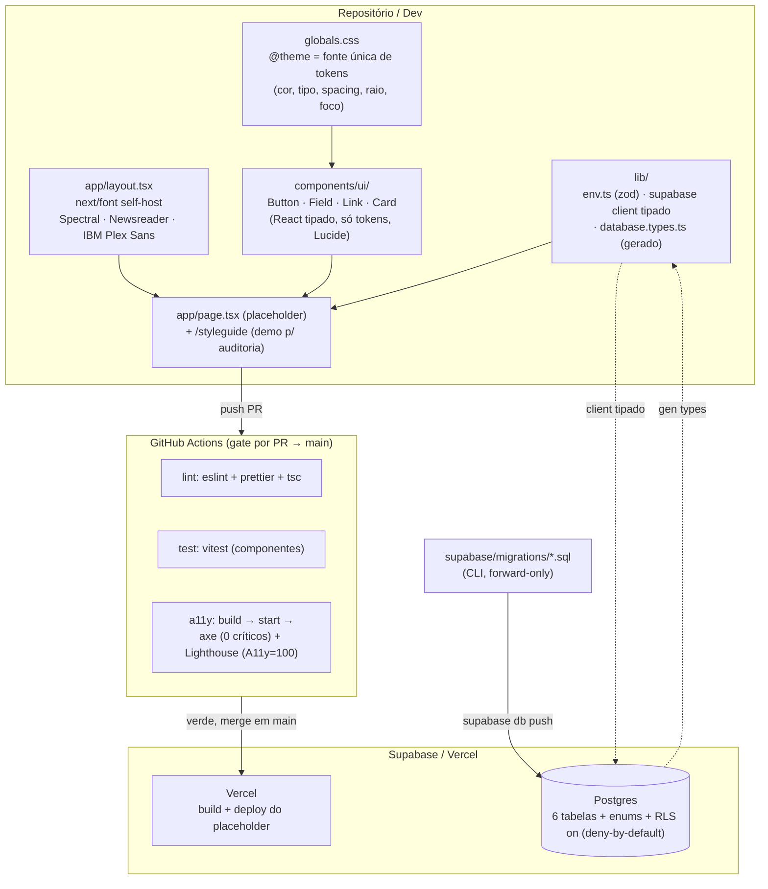
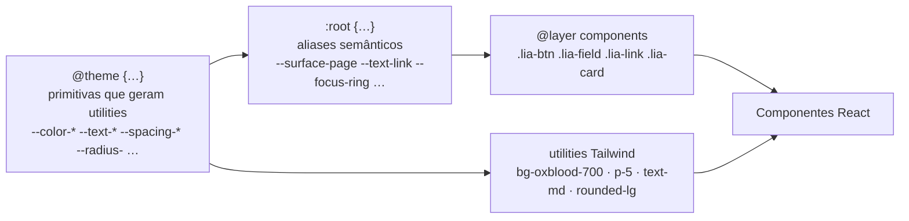
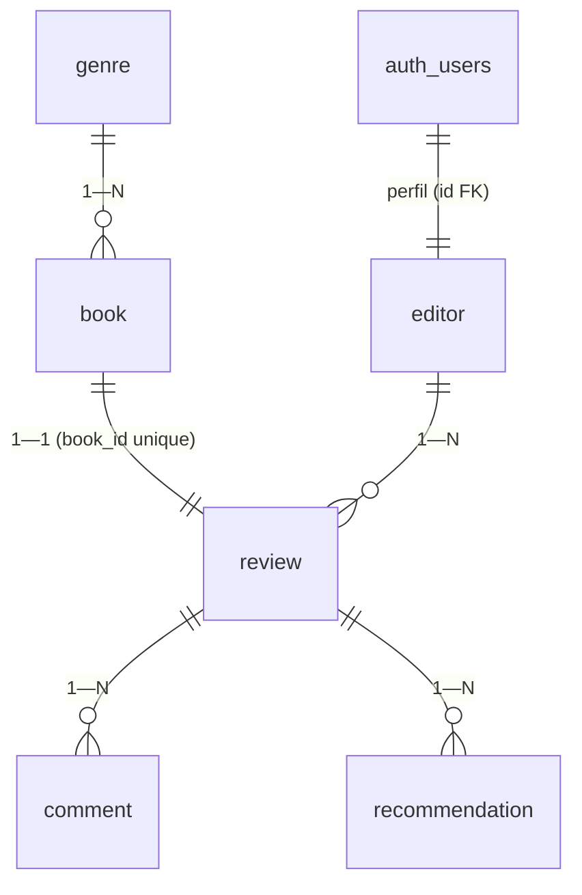

# infra-foundation — Design

**Spec**: [spec.md](spec.md) · **Status**: Draft
**Milestone**: M0 — Fundação · **Stack**: Next.js (App Router) + React + TypeScript + Tailwind v4 + Supabase
> Documentação em português; nomes de feature, schema, identificadores e código em inglês.

Greenfield: ainda **não existe repositório de aplicação**. Os artefatos de design (`docs/design/*.css`, `tailwind.config.js`) são **referência de especificação visual/a11y**, não código a importar — serão **portados** para o scaffold. Não há `.specs/codebase/` (sem brownfield / CONCERNS).

---

## Decisões de design confirmadas

| # | Decisão | Escolha | Origem |
| --- | --- | --- | --- |
| DD-1 | Versão do Tailwind | **v4 (`@theme`, CSS-first)** — tokens em `globals.css` como fonte única, sem `tailwind.config.js` | Pergunta de design (resolve INFRA-07 / todo "A confirmar no scaffold") |
| DD-2 | Escala de espaçamento | **Numérica do token (1–9)** via `--spacing: initial` + chaves explícitas (sem defaults residuais) | Pergunta de design (resolve INFRA-08) |
| DD-3 | Estilo dos componentes base | CSS portado da referência em `@layer components` consumindo **só tokens**, encapsulado em componentes React tipados | Discrição (preserva o CSS de a11y já auditado) |
| DD-4 | Test runner | **Vitest + React Testing Library** (unit/componente) + **Playwright + @axe-core/playwright** (página) + **Lighthouse CI** | Discrição (convenção atual Next.js) |
| DD-5 | Fontes | **`next/font/google`** (self-host no build, fallback métrico automático) | Discrição (resolve INFRA-10) |
| DD-6 | Migrations | **Supabase CLI** (`supabase/migrations/*.sql`), forward-only, criação guardada (idempotente) | Discrição (resolve INFRA-05/06) |
| DD-7 | Validação de env | Módulo `env.ts` com **zod**, falha explícita no boot | Discrição (resolve edge case "env ausente") |

> DD-1 e DD-2 serão registradas como ADR **D-07** e nota em STATE (INFRA-07 exige "ADR/STATE").

---

## Architecture Overview

Monólito Next.js (App Router) servido pela Vercel, com Supabase (Postgres + Auth + Storage) como backend. O M0 entrega o **esqueleto**: tokens, componentes, schema e o **gate de CI** — nenhuma tela de feature além do placeholder.



### Camadas de token (fonte única — DD-1)



Um único arquivo (`globals.css`) é a origem de cor, tipografia, spacing, raio, sombra e foco. Alterar `--color-oxblood-700` ali propaga para utilities **e** para o CSS dos componentes — zero hex duplicado (INFRA-07).

---

## Code Reuse Analysis

Não há código de aplicação a reusar (greenfield). Reuso = **portar a especificação dos artefatos de design**, corrigindo os dois defeitos que a spec apontou.

| Artefato de referência | Local | Como usar no scaffold |
| --- | --- | --- |
| Tokens (cores/contraste anotado, tipografia, raio, foco) | [lia-tokens.css](../../../docs/design/lia-tokens.css) | Portar `:root` → bloco `@theme` v4 + aliases `:root`. **Corrigir foco** (remover `border-radius` do `:focus-visible`). Preservar pares de contraste. |
| Escala de espaçamento | [lia-tokens.css:154-165](../../../docs/design/lia-tokens.css#L154-L165) | `--spacing: initial` + `--spacing-1..9` + `--spacing-target-min` (DD-2). |
| CSS dos componentes (button/field/link/card, estados a11y) | [lia-components.css](../../../docs/design/lia-components.css) | Portar para `@layer components`, trocar nomes de var p/ os do `@theme`, encapsular em React tipado. |
| Mapa Tailwind (snippet `@theme` v4) | [tailwind.config.js:231-246](../../../docs/design/tailwind.config.js#L231-L246) | Referência para os nomes namespaced do v4. **Não** copiar o `theme.extend.spacing` (é a fonte do bug INFRA-08). |
| Modelo de dados (6 entidades, relações) | [PRD §9](../../../docs/PRD-LIA.md) | Traduzir para migrations SQL versionadas. |

### Integration Points

| Sistema | Método de integração |
| --- | --- |
| Supabase Postgres | `@supabase/supabase-js` com tipos gerados (`supabase gen types typescript`); migrations via Supabase CLI. |
| Supabase Auth | `editor.id` referencia `auth.users(id)` (perfil ligado). M0 só habilita; políticas em M2. |
| Vercel | Deploy por push em `main`; env (URL/anon/service) no projeto Vercel (D-05). |
| GitHub Actions | Gate por PR; status verde rastreável ao commit; branch protection em `main`. |

---

## Components

### 1. Token layer — `src/app/globals.css`  ·  INFRA-07, 08, 09

- **Purpose**: Fonte única de tokens (Tailwind v4 `@theme`) + aliases semânticos + foco global corrigido.
- **Estrutura**:
  1. `@import "tailwindcss";`
  2. `@theme { … }` — primitivas que **geram utilities**: `--color-*` (paper/ink/oxblood/red/green/amber/blue/focus), `--font-display|body|ui`, `--text-xs..4xl` (+ `--text-*--line-height`), `--font-weight-*`, `--tracking-*`, `--leading-*`, `--radius-*`, `--shadow-*`, **spacing**, `--container-*`.
  3. **Spacing (DD-2)**: `--spacing: initial;` desliga a escala dinâmica; depois `--spacing-0..9` + `--spacing-target-min: 2.75rem`. Resultado: `p-5`=24px, `gap-6`=32px, `p-8`=64px — 1:1 com o token, **sem** chaves default conflitantes (INFRA-08).
  4. `:root { … }` — aliases semânticos consumidos pelo CSS de componente (não geram utilities): `--surface-page/card/subtle/hover/accent`, `--text-strong/body/secondary/muted/link/link-hover/on-accent`, `--border-*`, `--action-primary-*`, `--feedback-*`, `--focus-ring*`, `--ease-standard`, `--duration-*`.
  5. `@layer base` — **foco global corrigido (INFRA-09)**: `:where(a,button,input,select,textarea,summary,[tabindex]):focus-visible { outline: var(--focus-ring-width) solid var(--focus-ring); outline-offset: var(--focus-ring-offset-width); }` — **sem** `border-radius` no elemento (o outline acompanha o raio intrínseco). `prefers-reduced-motion` zera durações.
- **Reuses**: lia-tokens.css (portado + corrigido).
- **Done quando**: alterar um token em um lugar reflete em utility e componente; `grep` de hex não acha colisão entre fontes.

> **Correção INFRA-09 (detalhe):** o bug do export é `border-radius: var(--radius-sm)` dentro do `:focus-visible`, que reescreve a geometria do elemento ao focar. `outline`/`outline-offset` **não** alteram o box do elemento e, em navegadores atuais, o outline já segue o `border-radius` próprio. Para cantos grandes onde o offset "descola", usa-se a variante `.focus-ring-shadow` (anel por `box-shadow`, já no token). Largura 3px, folga 2px, cor `--focus-blue` preservadas.

### 2. Font layer — `src/app/layout.tsx`  ·  INFRA-03, 10

- **Purpose**: Self-host das 3 famílias via `next/font/google` + landmarks raiz + `lang="pt-BR"`.
- **Interfaces**: importa `Spectral` (weights 500/600/700), `Newsreader` (400), `IBM_Plex_Sans` (400/500/600), cada um `{ subsets: ['latin'], display: 'swap', variable: '--font-<x>' }`. No `@theme`: `--font-display: var(--font-spectral), Georgia, serif;` etc. (mapeia token → fonte self-hosted — INFRA-10 AC#3). `<html lang="pt-BR" className={…variables}>` com **skip link** como 1º filho de `<body>` e `<main id="main">`.
- **Dependencies**: `next/font/google`, globals.css.
- **Reuses**: token de família do export.
- **Done quando**: aba de rede mostra fontes do próprio domínio (sem CDN externo); CLS < 0,1 (fallback métrico automático do `next/font`).

### 3. Base components — `src/components/ui/`  ·  INFRA-11, 12, 13

Cada um: componente React tipado (`React.forwardRef`, props estendendo o elemento nativo), classes `.lia-*` portadas para `@layer components`, ícones **Lucide**. Consomem **apenas tokens**.

- **`Button.tsx`** — variantes `primary|secondary|ghost`, tamanhos `sm|md|lg` (md = alvo 44px, `--spacing-target-min`); `aria-disabled` em vez de bloquear foco quando desabilitado por ação; slot de ícone (`aria-hidden`). (AC: alvo 44px, foco corrigido.)
- **`Field.tsx`** — `label` associado (`htmlFor`/`id`), suporta `input|textarea|select`; estado de erro: `aria-invalid="true"` + mensagem `role="alert"` + **ícone Lucide `AlertCircle` (`aria-hidden`) e texto** (nunca só cor) + `aria-describedby` ligando controle↔erro/ajuda; `select` com chevron decorativo (`ChevronDown`, `aria-hidden`). (INFRA-12.)
- **`Link.tsx`** — sempre sublinhado (significado não depende de cor); variante `quiet`; ícone de link externo (`ExternalLink`, `aria-hidden`) quando `external`. (AC: sublinhado.)
- **`Card.tsx`** — `outline|raised|flat`; quando clicável inteiro vira `<a>` focável/operável por teclado com foco visível; subpartes `media|body|eyebrow|title|excerpt|footer`. (AC: card clicável focável.)
- **Dependencies**: globals.css (tokens), `lucide-react`.
- **Reuses**: lia-components.css (portado).
- **Done quando**: axe sem críticos na página de demo; teclado + leitor de tela OK; field em erro anuncia via `role="alert"`.

### 4. Styleguide / demo — `src/app/styleguide/page.tsx`  ·  INFRA-11, 15, 16

- **Purpose**: Página que renderiza cada componente em estados-chave (inclui field em erro e card clicável) — **alvo das auditorias axe/Lighthouse** no CI e teste manual de leitor de tela.
- **Dependencies**: componentes base.
- **Done quando**: axe 0 críticos; Lighthouse A11y = 100.

### 5. Placeholder — `src/app/page.tsx`  ·  INFRA-03, 17

- **Purpose**: Página raiz SSR acessível (sem JS também renderiza): `<main>`, hierarquia de headings correta, skip link funcional, sem violações axe.
- **Done quando**: navegação por teclado revela skip link e foco visível; `build` limpo; URL de produção Vercel preserva a11y.

### 6. Env + Supabase client — `src/lib/`  ·  INFRA-04

- **`env.ts`** — schema **zod** valida `NEXT_PUBLIC_SUPABASE_URL`, `NEXT_PUBLIC_SUPABASE_ANON_KEY` (e `SUPABASE_SERVICE_ROLE_KEY` server-only); **lança erro claro** se ausente/inválido (edge case "env ausente → falha explícita, não silenciosa").
- **`supabase/client.ts`** (browser, anon) e **`supabase/server.ts`** (server, cookies/service-role) — `@supabase/supabase-js` tipado com `Database` de `database.types.ts`.
- **`database.types.ts`** — gerado por `supabase gen types typescript` (não editar à mão).
- **Done quando**: `tsc` valida tipos do client; subir sem env falha com mensagem clara.

### 7. Migrations — `supabase/migrations/`  ·  INFRA-05, 06

SQL versionado (ver **Data Models**). Forward-only, criação **guardada** (enums via `DO $$ … IF NOT EXISTS`) para reaplicação segura (edge case idempotência). Ordem: `enums → tables (FK/unique/check/index/trigger) → enable RLS`.

### 8. CI workflow — `.github/workflows/ci.yml`  ·  INFRA-14, 15, 16

- **Jobs (por PR contra `main`)**:
  - `lint`: `eslint` + `prettier --check` + `tsc --noEmit`.
  - `test`: `vitest run` (componentes; opcional `vitest-axe` por componente).
  - `a11y`: `next build` → `next start` → **axe** via `@axe-core/playwright` em `/` e `/styleguide` (**falha em qualquer issue crítico** — INFRA-15) → **Lighthouse CI** (`@lhci/cli` ou `treosh/lighthouse-ci-action`) com assert `categories:accessibility >= 1.0` (**=100** — INFRA-16).
- **Done quando**: PR com violação a11y deliberada fica vermelho no passo axe/Lighthouse; corrigir → verde; status rastreável ao commit. Branch protection em `main` exige os checks (config no GitHub).

### 9. Deploy Vercel  ·  INFRA-17 (P2)

- Conectar repo à Vercel; env (`NEXT_PUBLIC_SUPABASE_URL/ANON_KEY`, `SUPABASE_SERVICE_ROLE_KEY`) no ambiente correto; push em `main` → build → publica placeholder. Auditar axe/Lighthouse na URL de produção.

---

## Data Models

Schema das 6 entidades núcleo (PRD §9). UUID PK, `timestamptz`, enums nativos. Relações: `review` 1—1 `book` (unique `book_id`), `review` 1—N `comment`, `review` 1—N `recommendation`, `editor` 1—N `review`, `genre` 1—N `book`.



### SQL (consolidado — vira migrations versionadas)

```sql
-- 1) enums (criação guardada → reaplicação segura)
do $$ begin
  if not exists (select 1 from pg_type where typname = 'review_status') then
    create type review_status as enum ('draft', 'published');
  end if;
  if not exists (select 1 from pg_type where typname = 'comment_status') then
    create type comment_status as enum ('pending', 'approved', 'rejected');
  end if;
  if not exists (select 1 from pg_type where typname = 'editor_role') then
    create type editor_role as enum ('admin', 'editor');
  end if;
end $$;

-- 2) genre  (genre 1—N book)
create table if not exists genre (
  id         uuid primary key default gen_random_uuid(),
  name       text not null,
  slug       text not null unique,
  created_at timestamptz not null default now()
);

-- 3) book
create table if not exists book (
  id                uuid primary key default gen_random_uuid(),
  title             text not null,
  author            text not null,
  genre_id          uuid references genre(id) on delete restrict,
  publisher         text,
  isbn              text,                 -- ISBN-10/13 validado na app (book-data, M1)
  cover_url         text,
  year              smallint,
  pages             integer,
  original_language text,
  translator        text,                 -- tradução opcional, estruturada
  translated_from   text,
  created_at        timestamptz not null default now()
);
create index if not exists book_genre_id_idx on book(genre_id);

-- 4) editor  (perfil ligado a auth.users — INFRA AC#7)
create table if not exists editor (
  id         uuid primary key references auth.users(id) on delete cascade,
  email      text not null unique,
  name       text not null,
  role       editor_role not null default 'editor',
  active      boolean not null default true,
  created_at timestamptz not null default now()
);

-- 5) review  (review 1—1 book via UNIQUE book_id; editor 1—N review)
create table if not exists review (
  id           uuid primary key default gen_random_uuid(),
  book_id      uuid not null unique references book(id) on delete cascade,
  title        text not null,
  slug         text not null unique,
  rating       numeric(2,1) check (rating >= 0 and rating <= 5),  -- D-01: range/meia-estrela confirmado em reviews-crud (M2)
  body         text,
  status       review_status not null default 'draft',
  editor_id    uuid references editor(id) on delete set null,
  published_at timestamptz,
  created_at   timestamptz not null default now(),
  updated_at   timestamptz not null default now()
);
create index if not exists review_status_idx   on review(status);
create index if not exists review_editor_id_idx on review(editor_id);

-- updated_at automático
create or replace function set_updated_at() returns trigger
  language plpgsql as $$
begin new.updated_at = now(); return new; end $$;
drop trigger if exists review_set_updated_at on review;
create trigger review_set_updated_at before update on review
  for each row execute function set_updated_at();

-- 6) comment  (review 1—N comment; author_name opcional; ip_hash = só hash, sem PII)
create table if not exists comment (
  id          uuid primary key default gen_random_uuid(),
  review_id   uuid not null references review(id) on delete cascade,
  author_name text,
  body        text not null,
  status      comment_status not null default 'pending',
  ip_hash     text,
  created_at  timestamptz not null default now()
);
create index if not exists comment_review_status_idx on comment(review_id, status);

-- 7) recommendation  (1 voto por visitante → unique(review_id, voter_hash))
create table if not exists recommendation (
  id         uuid primary key default gen_random_uuid(),
  review_id  uuid not null references review(id) on delete cascade,
  voter_hash text not null,
  created_at timestamptz not null default now(),
  unique (review_id, voter_hash)
);
create index if not exists recommendation_review_id_idx on recommendation(review_id);

-- 8) RLS habilitado, deny-by-default (políticas por papel → M2)
alter table genre          enable row level security;
alter table book           enable row level security;
alter table editor         enable row level security;
alter table review         enable row level security;
alter table comment        enable row level security;
alter table recommendation enable row level security;
-- (sem CREATE POLICY: anon/authenticated negados; service_role contorna RLS p/ seed/admin)
```

### Tipos (gerados — uso na app)

```typescript
// src/lib/database.types.ts — via `supabase gen types typescript`; NÃO editar à mão.
// Exemplo do contrato resultante (somente ilustrativo):
type ReviewStatus = 'draft' | 'published'
type CommentStatus = 'pending' | 'approved' | 'rejected'
type EditorRole = 'admin' | 'editor'

interface Review {
  id: string
  book_id: string          // 1—1 com book
  title: string
  slug: string             // único
  rating: number | null    // numeric(2,1), 0–5
  body: string | null
  status: ReviewStatus
  editor_id: string | null
  published_at: string | null
  created_at: string
  updated_at: string
}
```

**Notas de relação / decisão**
- `review.book_id` **UNIQUE** garante 1—1 (AC#2); `on delete cascade` (livro é a âncora da resenha).
- `editor_id on delete set null`: remover conta de editor preserva a resenha.
- `genre_id on delete restrict`: não apaga gênero em uso; `genre_id` nullable agora (book-data/M1 endurece obrigatoriedade na app).
- **RLS sem política bloqueia leitura pública** — intencional no M0 (placeholder não lê dados). **M1 adiciona policies de leitura** de `published`; **M2** as de escrita/papel. Registrar como handoff p/ M1.

---

## Error Handling Strategy

| Cenário | Tratamento | Impacto no usuário |
| --- | --- | --- |
| Env do Supabase ausente/ inválida | `env.ts` (zod) lança no boot com mensagem nomeando a var | Build/dev falha explícito (não silencioso) — edge case |
| Voto duplicado (mesmo `voter_hash`) | Constraint `unique(review_id, voter_hash)` rejeita | Banco recusa; app trata em `recommendations` (M3) |
| Migration reaplicada | Criação guardada (`if not exists` / `DO`) | Reaplicar não corrompe nem duplica |
| Violação a11y num PR | Gate axe/Lighthouse reprova | Merge bloqueado até corrigir (INFRA-15/16) |
| Erro de tipo/build | `tsc --noEmit` + `next build` no CI | PR vermelho |
| `prefers-reduced-motion` | Tokens zeram durações; hover sem `translateY` | Sem animação para quem pediu |
| Zoom até 200% / fonte grande | Escala em `rem` | Layout permanece utilizável |
| JS desabilitado | Placeholder SSR | Conteúdo + landmarks renderizam |

---

## Tech Decisions (não óbvias)

| Decisão | Escolha | Racional |
| --- | --- | --- |
| Versão Tailwind (DD-1) | **v4 `@theme`** | Padrão recomendado p/ projeto novo; CSS-first = fonte única nativa (INFRA-07); `create-next-app --tailwind` instala v4. → ADR **D-07**. |
| Spacing (DD-2) | **`--spacing: initial` + chaves 1–9** | Em v4 o `--spacing` é multiplicador dinâmico (`p-5`=20px). Resetar + chaves explícitas honra o token 1:1 sem defaults residuais (INFRA-08). Trade-off documentado: `p-8`=64px diverge da convenção numérica do Tailwind. |
| Foco (INFRA-09) | **outline + offset, sem `border-radius` no elemento** | `outline` não altera o box; segue o raio intrínseco. `.focus-ring-shadow` p/ cantos grandes. Corrige o bug do export. |
| Componentes (DD-3) | **CSS portado em `@layer components` + wrapper React** | Preserva o CSS de a11y já auditado (estados de erro/foco) e expõe API tipada — menos risco que reescrever do zero. |
| Fontes (DD-5) | **`next/font/google`** | Self-host no build (sem CDN externo, privacidade), fallback com `size-adjust` → CLS<0,1 (INFRA-10). |
| Test/a11y CI (DD-4) | **Vitest + @axe-core/playwright + Lighthouse CI** | axe (0 críticos) e Lighthouse (A11y=100) são gates distintos exigidos pela spec; Vitest é o runner atual do ecossistema Next. |
| Validação env (DD-7) | **zod em `env.ts`** | Falha explícita e tipada no boot (edge case). |

---

## Rastreabilidade Requisito → Componente

| Req | Componente(s) |
| --- | --- |
| INFRA-01/02/03 | Scaffold + ESLint/Prettier + layout/placeholder (#2, #5) |
| INFRA-04 | env.ts + supabase client tipado (#6) |
| INFRA-05/06 | Migrations + RLS (#7, Data Models) |
| INFRA-07 | Token layer `@theme` (#1) |
| INFRA-08 | Spacing `--spacing: initial` + 1–9 (#1) |
| INFRA-09 | Foco global corrigido (#1) |
| INFRA-10 | Font layer `next/font` (#2) |
| INFRA-11 | Button/Field/Link/Card + styleguide (#3, #4) |
| INFRA-12 | Field — padrão de erro (#3) |
| INFRA-13 | Lucide nos componentes (#3) |
| INFRA-14/15/16 | CI workflow (#8) |
| INFRA-17 | Deploy Vercel (#9) |

**Cobertura:** 17/17 requisitos endereçados no design (mapeamento para tasks atômicas → fase **Tasks**).

---

## Open handoffs (para fases seguintes)

- **M1**: adicionar RLS policies de leitura (`status='published'`); endurecer `book.genre_id` obrigatório (book-data); D-04 (busca).
- **M2**: RLS de escrita por papel; finalizar D-01 (range/meia-estrela de `review.rating`).
- **M3**: lógica de `recommendation` (D-03) e anti-spam de `comment` (D-02).
