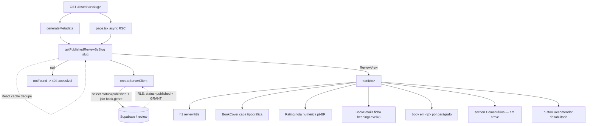

# review-page — Design

**Spec**: [spec.md](spec.md) · **Context**: [context.md](context.md)
**Status**: Approved (revisão de 2026-06-12 — 3 pontos abertos resolvidos, ver fim do doc)

> Documentação em português; nomes de feature, schema, identificadores e código em inglês.
> Reusa [BookDetails](../../../src/components/book/BookDetails.tsx), o padrão de query de
> [book/queries.ts](../../../src/lib/book/queries.ts), os tokens/`lia-*` do M0 e os padrões de
> migration 0003 (policy guardada) + 0004 (GRANT explícito).

---

## Architecture Overview

Rota dinâmica do App Router (`/resenha/[slug]`) renderizada **no servidor**. O `page.tsx` é um
React Server Component `async`: resolve o `slug` via uma camada de query tipada
(`getPublishedReviewBySlug`), e se nada volta chama `notFound()`. O conteúdo é montado como um
`<article>` semântico que **reusa** `BookDetails` para a ficha e dois componentes apresentacionais
novos (`BookCover`, `Rating`). Nenhum componente de cliente entra no caminho factual — a página é
100% SSR (RVW-26).

A leitura pública depende de **dois gates independentes**, ambos necessários:

1. **Filtro explícito na query** (`status = 'published'`) — único gate quando o server client usa
   `SUPABASE_SERVICE_ROLE_KEY` (que **ignora RLS**, ver [server.ts](../../../src/lib/supabase/server.ts)).
2. **RLS policy + GRANT** em `review` — o gate quando o server client cai no fallback da chave
   `anon`/publishable, e para qualquer consumo anônimo do Data API.



---

## Code Reuse Analysis

### Existing Components to Leverage

| Component | Location | How to Use |
| --- | --- | --- |
| `BookDetails` | [src/components/book/BookDetails.tsx](../../../src/components/book/BookDetails.tsx) | Importar direto para a ficha; passar `headingLevel={3}` (Tradução vira `<h3>` sob o `<h2>` "Ficha técnica"). |
| `BookView` + padrão de query | [src/lib/book/queries.ts](../../../src/lib/book/queries.ts) | Espelhar o módulo: `ReviewView`, `select` com join, `maybeSingle`, `throw error`. |
| `createServerClient` | [src/lib/supabase/server.ts](../../../src/lib/supabase/server.ts) | Cliente tipado no servidor. **Atenção**: usa `service_role` quando presente → não confiar só em RLS. |
| Classe `lia-card__media` | [globals.css](../../../src/app/globals.css) (l.483) | Base visual da capa tipográfica (aspect-ratio 3/2). |
| Classes `lia-btn`, `lia-btn--secondary` | globals.css / [Button.tsx](../../../src/components/ui/Button.tsx) | Estilo do botão "Recomendar" desabilitado (markup server-side, sem importar o componente cliente). |
| Padrão migration 0003 (policy guardada) | [0003_book_public_read_policy.sql](../../../supabase/migrations/0003_book_public_read_policy.sql) | Guarda via `pg_policies` para idempotência. |
| Padrão migration 0004 (GRANT explícito) | [0004_public_read_grants.sql](../../../supabase/migrations/0004_public_read_grants.sql) | `grant select` idempotente (TD-03). |
| Padrão seed (DO block idempotente) | [seed.sql](../../../supabase/seed.sql) | UUIDs fixos + `on conflict (id) do nothing`. |
| Padrão teste RLS local-only | [book/__tests__/rls.integration.test.ts](../../../src/lib/book/__tests__/rls.integration.test.ts) | Mesma estrutura `describe.skipIf(!RUN)` (TD-02). |

### Integration Points

| System | Integration Method |
| --- | --- |
| Layout raiz | A página vive sob o `<main id="main">` já provido por [layout.tsx](../../../src/app/layout.tsx); fornece só o `<article>` (RVW-05). Skip link já existe. |
| `review` (DB) | Nova policy + GRANT de leitura filtrada (`status='published'`); escrita permanece deny-by-default. |
| `book`/`genre` (DB) | Já legíveis (GRANT 0004); o join reusa o mesmo caminho público da `book-data`. |
| `seo-core` (M1, futuro) | `generateMetadata` retorna o objeto `Metadata` base; `seo-core` o **estende** com JSON-LD/sitemap (RVW-19/20/21). |

---

## Components

### `getPublishedReviewBySlug` (camada de query)

- **Purpose**: Buscar uma resenha **publicada** pelo `slug`, com ficha do livro embutida, numa leitura tipada.
- **Location**: `src/lib/review/queries.ts`
- **Interfaces**:
  - `getPublishedReviewBySlug(slug: string): Promise<ReviewView | null>` — `null` quando inexistente **ou** `draft`.
- **Comportamento**:
  - `select('*, book(*, genre(name, slug))')`, `.eq('slug', slug)`, **`.eq('status', 'published')`**, `.maybeSingle()`.
  - O filtro `status='published'` é **explícito na query** (não delegado ao RLS) — RVW-03/RVW-13 valem mesmo com `service_role`.
  - Envolver a função em **`cache()` do React** (`import { cache } from 'react'`) para deduplicar a chamada dupla `generateMetadata` + `page` numa mesma requisição.
  - `if (error) throw error` (deixa o Next exibir o boundary de erro); `null` → `notFound()` no chamador.
- **Reuses**: padrão de [book/queries.ts](../../../src/lib/book/queries.ts) (mesmo estilo de cast e `maybeSingle`).

### `BookCover` (capa tipográfica)

- **Purpose**: Renderizar a capa **tipográfica** de fallback (título sobre fundo de marca) quando não há imagem.
- **Location**: `src/components/book/BookCover.tsx` (server component, sem `'use client'`).
- **Interfaces**:
  - `BookCover({ title }: { title: string })` — RVW-12: **não** processa `cover_url`; o pipeline de imagem é de `storage-covers`. (Recebe só `title` para deixar o contrato mínimo e à prova de escopo.)
- **Markup** (segue [telas-finais.html](../../../docs/design/telas-finais.html) l.245):
  `<span class="lia-card__media lia-card__media--type" role="img" aria-label={`Capa de ${title}`}>` com o título visível dentro; fundo `--oxblood-700`, texto `--paper-0`.
  - Alternativa textual via `role="img"` + `aria-label` (RVW-11 AC#2); o título não é só imagem.
  - Nova classe `lia-card__media--type` em globals.css (flex, `align-items:flex-end`, padding, `background:var(--oxblood-700)`, `color:var(--paper-0)`) — encapsula o `style` inline do mock em token-only.
- **Reuses**: classe `lia-card__media` (aspect-ratio 3/2) já existente.

### `Rating` (exibição da nota)

- **Purpose**: Exibir `review.rating` como **valor numérico** localizado, com texto acessível (C-1, RVW-08).
- **Location**: `src/components/review/Rating.tsx` (server component) + util `src/lib/review/rating.ts`.
- **Interfaces**:
  - `formatRating(rating: number): string` — util **puro** (testável): `4.5 → "4,5"` via `Intl.NumberFormat('pt-BR', { minimumFractionDigits: 1, maximumFractionDigits: 1 })`.
  - `Rating({ rating }: { rating: number })` — renderiza `4,5 / 5` visível + `<span class="sr-only">Nota: 4,5 de 5</span>` para leitor de tela.
- **Comportamento**: **sem** estrelas/medidor (C-1). O **chamador** decide se renderiza (omitir quando `rating == null`, RVW-09) — o componente assume `rating` presente.
- **Reuses**: classe utilitária `sr-only` (já usada no skip link/layout).

### Página de resenha (rota)

- **Purpose**: Compor a resenha completa num `<article>` SSR e emitir SEO/404.
- **Location**: `src/app/resenha/[slug]/page.tsx` (RSC `async`) + `src/app/resenha/[slug]/not-found.tsx`.
- **Interfaces**:
  - `export async function generateMetadata({ params }): Promise<Metadata>` — busca via `getPublishedReviewBySlug`; se `null`, retorna `Metadata` genérico **sem dados de resenha** (RVW-21). Senão: `title: "${review.title} · LIA"`, `description` = resumo do `body` (primeiros ~160 chars, corte em palavra), `openGraph: { title, description, type: 'article', url: '/resenha/${slug}' }` (RVW-19/20). A URL vira **absoluta** via `metadataBase` definido no `metadata` raiz do layout (decisão da revisão).
  - `export default async function ReviewPage({ params })` — resolve, `notFound()` se `null`, renderiza o `<article>`.
- **Estrutura semântica / ordem dos blocos** (RVW-24, headings coerentes):
  ```
  <article class="lia-review">
    <header>
      <h1>{review.title}</h1>                        // RVW-06
      <p>{book.title} — {book.author}</p>            // contexto da obra
      {rating != null && <Rating rating={rating} />} // RVW-08/09
    </header>
    <BookCover title={book.title} />                  // RVW-11
    <section aria-labelledby="ficha">
      <h2 id="ficha">Ficha técnica</h2>
      <BookDetails book={book} headingLevel={3} />    // RVW-07 (Tradução = h3)
    </section>
    <section aria-labelledby="resenha-texto">
      <h2 id="resenha-texto">Resenha</h2>
      {paragraphs(body).map(p => <p>{p}</p>)}         // RVW-10
    </section>
    <section aria-labelledby="comentarios">           // RVW-22
      <h2 id="comentarios">Comentários</h2>
      <p>Os comentários chegam em breve.</p>
    </section>
    <footer>
      <button type="button" class="lia-btn lia-btn--secondary lia-btn--md"
              disabled aria-describedby="rec-soon">Recomendar</button>  // RVW-23
      <span id="rec-soon" class="...">Disponível em breve</span>
    </footer>
  </article>
  ```
- **Renderização do `body`** (RVW-10): `body` é **texto puro** no M1. Helper `splitParagraphs(body): string[]` → `body.split(/\n{2,}/).map(s => s.trim()).filter(Boolean)`; cada item vira `<p>`. Sem `dangerouslySetInnerHTML` (markdown/HTML é M2). `body` vazio/nulo → array vazio, seção sem parágrafos (RVW-10 AC#6, degradação graciosa).
- **Dependencies**: `getPublishedReviewBySlug`, `notFound` (next/navigation), `BookDetails`, `BookCover`, `Rating`.
- **Reuses**: `<main>`/skip link do layout; tokens `lia-*`.

### Migration `0005_review_public_read.sql`

- **Purpose**: Abrir leitura pública filtrada de `review` (policy + GRANT), mantendo escrita fechada.
- **Location**: `supabase/migrations/0005_review_public_read.sql`
- **Conteúdo** (arquivo único; policy + grant juntos por serem a mesma preocupação `review`-only):
  - Policy guardada via `pg_policies` (idempotente, padrão 0003):
    `create policy "review_public_read" on review for select to anon, authenticated using (status = 'published');`
  - GRANT explícito (idempotente, padrão 0004, TD-03):
    `grant select on table review to anon, authenticated;`
  - **Sem** policy/grant de INSERT/UPDATE/DELETE → escrita deny-by-default (RVW-15 AC#4). RLS permanece habilitado (não há `disable`).
- **Decisão de numeração**: **um** arquivo `0005` (não dois) — diferente do par 0003/0004 porque aqui o escopo é só `review` (lá o GRANT cobria `book`+`genre`). GRANT de `review` ao `service_role` continua **fora de escopo** (TD-03).

### Seed de resenhas (extensão de `seed.sql`)

- **Purpose**: 1 resenha publicada por livro (4) + 1 `draft` para teste de visibilidade.
- **Location**: append no `do $$` block de [seed.sql](../../../supabase/seed.sql) (após os `insert into book`).
- **Conteúdo**:
  - `insert into review (id, book_id, title, slug, rating, body, status, published_at) values (...) on conflict (id) do nothing;` — UUIDs fixos (`bbbbbbbb-…`), `slug` derivado do título (`dom-casmurro`, `o-crime-do-padre-amaro`, `iracema`, `o-cortico`), `rating` plausível dentro do `check` 0–5 e cabendo em `numeric(2,1)` (ex.: 4.7→**4.5**? não: `numeric(2,1)` só 1 casa → usar 4.5, 4.0, 4.5, 5.0), `body` multi-parágrafo (`\n\n`), `status='published'`, `published_at = now()`.
  - `editor_id` **omitido** (nullable, FK `on delete set null`) — RVW-17 AC#4 / RVW-16: sem editores no M1.
  - **1 extra `status='draft'`** (RVW-18): como `book_id` é UNIQUE 1—1 e os 4 livros já terão resenha publicada, semear um **5º book de teste** (domínio público, ex.: "Memórias Póstumas de Brás Cubas", `aaaaaaaa-…0005`) com sua review `draft` (slug ex.: `memorias-postumas-rascunho`, `published_at` nulo). Respeita o 1—1 e dá um caso real "publicado vs. rascunho" ao teste de RLS. **(Decidido na revisão de 2026-06-12.)**
- **Reuses**: idempotência e estilo do seed atual.

### Teste de integração RLS (`review`)

- **Purpose**: Provar leitura pública filtrada + escrita fechada (RVW-13/14/15), padrão local-only TD-02.
- **Location**: `src/lib/review/__tests__/rls.integration.test.ts`
- **Casos** (cliente **anon** sobre dados do seed — **não** precisa de `service_role` em `review`, então não esbarra na TD-03):
  1. anon `select` em `review` retorna só publicadas (4) e contém os slugs do seed.
  2. a review `draft` semeada **não** aparece para anon (filtrada, sem erro).
  3. anon `insert`/`update`/`delete` em `review` → erro `42501` (sem grant/policy de escrita).
  4. RLS de `review` permanece `enabled` (consulta a `pg_tables`/metadados, como no teste de `book`).
- **Reuses**: estrutura `describe.skipIf(!RUN)`, leitura de chaves locais via env (nunca hardcoded).

---

## Data Models

### `ReviewView` (tipo de leitura)

```typescript
// src/lib/review/queries.ts
import type { Tables } from '@/lib/database.types'
import type { BookView } from '@/lib/book/queries'

export type ReviewView = Tables<'review'> & {
  book: BookView // book + genre embutidos
}
```

**Relationships**: `review` 1—1 `book` (via `book_id` UNIQUE); `book` N—1 `genre`. O `select` aninha
`book(*, genre(name, slug))`, reaproveitando o shape de `BookView`. `rating: number | null`,
`body: string | null`, `editor_id: string | null` conforme o schema 0001.

---

## Error Handling Strategy

| Error Scenario | Handling | User Impact |
| --- | --- | --- |
| Slug inexistente | query → `null` → `notFound()` | Página 404 acessível (`not-found.tsx`) |
| Resenha `draft` | filtro `status='published'` → `null` → `notFound()` | 404 (indistinguível de inexistente) |
| `rating` nulo | chamador omite `<Rating>` | Sem bloco de nota (RVW-09) |
| `body` vazio/nulo | `splitParagraphs` → `[]` | Seção "Resenha" sem parágrafos, sem quebra |
| `cover_url` ausente (todo o seed) | `BookCover` tipográfico (caminho normal) | Capa com título + `aria-label` |
| Erro de rede/DB no `select` | `throw error` | Boundary de erro do Next (não 404) |
| `generateMetadata` em 404 | retorna `Metadata` genérico | Sem vazar dados de resenha (RVW-21) |

---

## Tech Decisions (não óbvias)

| Decisão | Escolha | Rationale |
| --- | --- | --- |
| Filtro de `status` | **Explícito na query** + RLS | `createServerClient` usa `service_role` (ignora RLS); o filtro na query é o gate efetivo no SSR. RLS+GRANT cobre o caminho anon/Data API. Ambos necessários. |
| Dedupe de fetch | `cache()` do React em `getPublishedReviewBySlug` | `generateMetadata` e `page` chamam a mesma query na mesma request; `cache()` evita 2 viagens ao banco. |
| Migration | **Um** arquivo `0005` (policy + grant) | Escopo só `review`; o split 0003/0004 existia porque o grant cobria 2 tabelas. |
| Botão "Recomendar" | `<button disabled>` **server-side** com classes `lia-btn` (não o componente `Button`) | `Button` é `'use client'` e usa `aria-disabled` (mantém no tab order). Para um placeholder sem ação, markup SSR puro com `disabled` nativo mantém a página sem ilha de hidratação (RVW-26) e comunica indisponibilidade (RVW-23). |
| Nota | util `formatRating` (puro) + `Rating` (apresentacional) | C-1: só número. Util testável isolado; componente reusável pela `review-listing-search`. |
| Capa | Componente `BookCover` generalizado em `components/book/` | Reuso futuro por `review-listing-search`/`storage-covers`; contrato mínimo (`title`) à prova de escopo (RVW-12). |
| Draft no seed | 5º book de teste + review `draft` | Respeita o 1—1 `book`↔`review` e dá caso real ao teste de RLS (RVW-18). **(Decidido na revisão.)** |
| Heading do texto | `<section>` com `<h2>Resenha</h2>` explícito | Hierarquia/âncora previsível para a11y e M3. **(Decidido na revisão.)** |
| OG url | `metadataBase` no `metadata` raiz do layout | `og:url`/canonical absolutas corretas já nesta feature (não esperar `seo-core`). **(Decidido na revisão.)** |
| Teste de RLS | Só cliente **anon** sobre o seed | Evita precisar de GRANT de `review` ao `service_role` (TD-03 fora de escopo). |

---

## Concerns / Riscos

- **TD-03 (grants pós-2026-05-30)**: o GRANT de `review` é obrigatório — sem ele o caminho anon falha com `42501`. Coberto por RVW-14 + teste de integração.
- **`numeric(2,1)`**: ratings do seed só podem ter 1 casa decimal (ex.: `4.5`, não `4.75`). Validar no seed.
- **`service_role` no SSR**: se algum dia a página precisar rodar com a chave anon (ex.: edge), o filtro explícito + RLS já garantem; nenhuma mudança necessária.
- **Sem `not-found.tsx` global hoje**: adicionamos um por rota para 404 acessível (RVW-02). Avaliar promover a global numa feature futura.

---

## Mapeamento Requisito → Componente

| Componente / Arquivo | Requisitos |
| --- | --- |
| `src/app/resenha/[slug]/page.tsx` | RVW-01, 05, 06, 09, 10, 24, 25, 26 |
| `src/app/resenha/[slug]/not-found.tsx` | RVW-02, 03 (parte UI) |
| `src/lib/review/queries.ts` (`getPublishedReviewBySlug`, `ReviewView`) | RVW-03, 04, 13 (filtro app-side) |
| `src/components/book/BookCover.tsx` | RVW-11, 12 |
| `src/components/review/Rating.tsx` + `src/lib/review/rating.ts` | RVW-08, 09 |
| `BookDetails` (reuso) | RVW-07 |
| `generateMetadata` (na page) | RVW-19, 20, 21 |
| Placeholders na page | RVW-22, 23 |
| `supabase/migrations/0005_review_public_read.sql` | RVW-13, 14, 15 |
| `supabase/seed.sql` (extensão) | RVW-16, 17, 18 |
| `src/lib/review/__tests__/rls.integration.test.ts` | RVW-13, 14, 15 (verificação) |
| a11y/SSR transversal (gate axe/CI) | RVW-24, 25, 26, 27 |

**Cobertura:** 27/27 requisitos mapeados a componentes. (Mapeamento requisito→**task** acontece na fase Tasks.)

---

## Decisões da revisão (2026-06-12)

1. **Draft no seed** → ✅ criar 5º book de teste ("Memórias Póstumas de Brás Cubas") com review `draft` (RVW-18). Respeita o 1—1 e dá caso real ao teste de RLS.
2. **Seção "Resenha"** → ✅ `<section>` com `<h2>Resenha</h2>` explícito antes dos parágrafos do `body`.
3. **`og:url` absoluta** → ✅ adicionar `metadataBase` ao `metadata` raiz do [layout.tsx](../../../src/app/layout.tsx) (nova micro-task na fase Tasks); OG/canonical absolutos já nesta feature.

Design **aprovado** — pronto para a fase **Tasks**.
