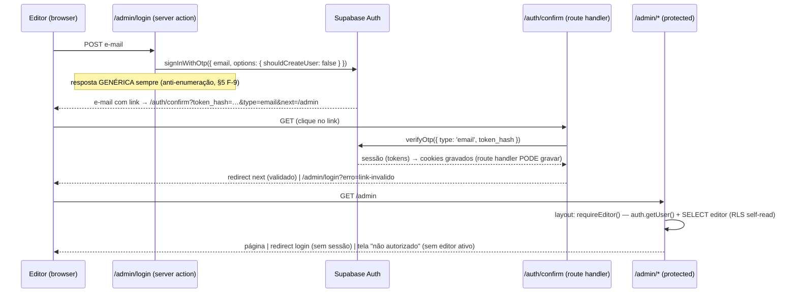

# security-foundation — Design

> Milestone **M2** · Fase **Design** · Branch `feat/security-foundation`
> Fonte de verdade: [spec.md](spec.md) (SEC-01..19) + [context.md](context.md) (C-1..C-6, todas resolvidas) · Reconciliação C-5 no [ROADMAP](../../project/ROADMAP.md).
> **NATUREZA DESTE DOCUMENTO: somente design.** Nenhum SQL foi executado, nenhuma migration aplicada, nenhuma dependência instalada. Todo DDL aqui é **ILUSTRATIVO — NÃO APLICAR** até a fase Execute (e o `db push` tem STOP próprio, ver §2.6).
> Estado do repo verificado em 2026-07-07: fallback vivo em [server.ts:8](../../../src/lib/supabase/server.ts#L8); maior migration existente = **0006**; `@supabase/ssr` **não instalado**; Next **16.2.7**.

---

## §1. Arquitetura dos 3 clients (fecha TD-04)

### 1.1 Estado atual (evidência)

| Arquivo | Estado hoje | Problema |
| --- | --- | --- |
| [src/lib/supabase/server.ts:8](../../../src/lib/supabase/server.ts#L8) | `env.SUPABASE_SERVICE_ROLE_KEY ?? env.NEXT_PUBLIC_SUPABASE_PUBLISHABLE_KEY` | **TD-04**: uma única fábrica decide o papel por env var. Vira bypass de RLS na rota pública no instante em que a service_role existir no ambiente. |
| [src/lib/supabase/client.ts](../../../src/lib/supabase/client.ts) | Singleton anon **eager** (instancia no import) | **Zero consumidores** em `src/` (verificado por grep). Código morto que instancia client no load do módulo. |
| [src/lib/env.ts](../../../src/lib/env.ts) | Schema Zod único com `SUPABASE_SERVICE_ROLE_KEY` opcional; `schema.parse(process.env)` **no import** | O caminho público *referencia* a service_role no seu schema de env; validação eager detona testes sem env (lição registrada em STATE.md). |

Consumidores de `createServerClient()` hoje (todos leitura pública): [src/lib/book/queries.ts:1](../../../src/lib/book/queries.ts#L1) e [src/lib/review/queries.ts:3](../../../src/lib/review/queries.ts#L3). Únicos consumidores de `@/lib/env` são os dois módulos de client — a reescrita é contida.

### 1.2 Estrutura alvo

```
src/lib/
├── env.ts                      # REESCRITO — SÓ vars públicas (URL + publishable). Zero menção a service_role.
├── env.admin.ts                # NOVO — import 'server-only'; SUPABASE_SERVICE_ROLE_KEY validada LAZY (na chamada).
└── supabase/
    ├── public.ts               # NOVO — createPublicClient(): anon/publishable, sem sessão. Substitui server.ts.
    ├── authenticated.ts        # NOVO — import 'server-only'; createAuthenticatedClient(): @supabase/ssr + cookies().
    ├── admin.ts                # NOVO — import 'server-only'; createAdminClient(): service_role. DORMENTE (C-2).
    ├── server.ts               # ❌ REMOVIDO — o fallback `??` morre com o arquivo (SEC-02).
    └── client.ts               # ❌ REMOVIDO — sem consumidores; o client público cobre o caso (ver §9 A-7).
```

**O que cada client importa (grafo de imports, sem rota do público até a service_role):**

| Client | Fábrica (SEC-01) | Chave | Env que importa | `server-only`? | RLS |
| --- | --- | --- | --- | --- | --- |
| **público** | `createPublicClient()` em `public.ts` | publishable (anon) | **só** `env.ts` (público) | não (isomórfico; só env pública) | **gate** |
| **autenticado** | `createAuthenticatedClient()` em `authenticated.ts` | publishable + **JWT do editor via cookies** | **só** `env.ts` + `@supabase/ssr` + `next/headers` | **sim** | **gate** (papel `authenticated`) |
| **admin** | `createAdminClient()` em `admin.ts` | `service_role` | `env.admin.ts` (e **só ele**) | **sim** | bypass — **dormente nesta feature** |

Nenhuma função decide papel por env var: três fábricas nomeadas, três módulos, três superfícies de env (SEC-01). `public.ts` e `env.ts` **não contêm a string `SERVICE_ROLE`** — não há rota de import do caminho público até a chave (SEC-02): `queries.ts → public.ts → env.ts` e a cadeia termina aí.

### 1.3 Isolamento ESTRUTURAL (não por convenção) — 3 camadas redundantes (C-3)

1. **`import 'server-only'`** no topo de `admin.ts`, `env.admin.ts` e `authenticated.ts` — se qualquer um entrar em bundle de cliente, o **build do Next falha** (SEC-03). Requer o pacote npm `server-only` (**não instalado hoje** — dependência nova, ver §1.6).
2. **Env sem `NEXT_PUBLIC`** — `SUPABASE_SERVICE_ROLE_KEY` nunca é inlinada em bundle de browser por construção do Next (SEC-04).
3. **Lint boundary com allowlist VAZIA** — regra ESLint `no-restricted-imports` proibindo `@/lib/supabase/admin` e `@/lib/env.admin` em **todo o projeto** (flat config em [eslint.config.mjs](../../../eslint.config.mjs)):

   ```js
   // ILUSTRATIVO — NÃO APLICAR
   {
     files: ['src/**/*.{ts,tsx}'],
     rules: {
       'no-restricted-imports': ['error', { paths: [
         { name: '@/lib/supabase/admin',
           message: 'service_role é DORMENTE (C-2). Exceções exigem ADR + allowlist explícita aqui.' },
         { name: '@/lib/env.admin', message: 'idem' },
       ]}],
     },
   }
   ```

   A allowlist vazia **materializa a dormência da C-2 como código**: hoje nenhum arquivo pode importar o admin; a feature futura que especificar uma exceção real de bypass terá que editar a regra deliberadamente (diff revisável), não apenas "começar a usar". Por que a 3ª camada importa: `server-only` impede import em bundle de **cliente**, mas **não** impede um Server Component público de importar `admin.ts` e rodar queries com bypass no servidor — só o lint fecha esse buraco (ver §5, modo F-2).

### 1.4 Remoção explícita do fallback

`server.ts` é **removido** (não editado): `createServerClient` deixa de existir; `book/queries.ts` e `review/queries.ts` passam a importar `createPublicClient` de `public.ts` (SEC-05). A leitura pública continua anon com o filtro `status='published'` explícito nas queries (defesa em profundidade já existente — [review/queries.ts:127](../../../src/lib/review/queries.ts#L127)) e RLS como gate. **Sem mudança de comportamento observável em produção** (Production não tem a service_role — verificado em STATE/TD-04); em dev local com `SUPABASE_SERVICE_ROLE_KEY` no `.env.local`, o caminho público **deixa** de enxergar drafts — essa é exatamente a correção (SEC-14 prova).

```ts
// ILUSTRATIVO — NÃO APLICAR · src/lib/supabase/public.ts
import { createClient } from '@supabase/supabase-js'
import type { Database } from '@/lib/database.types'
import { env } from '@/lib/env'

export function createPublicClient() {
  return createClient<Database>(
    env.NEXT_PUBLIC_SUPABASE_URL,
    env.NEXT_PUBLIC_SUPABASE_PUBLISHABLE_KEY, // única chave possível — sem ??, sem service_role
    { auth: { persistSession: false } }
  )
}
```

### 1.5 Validação de env POR client

- **`env.ts` (público, reescrito):** schema Zod **apenas** com `NEXT_PUBLIC_SUPABASE_URL` e `NEXT_PUBLIC_SUPABASE_PUBLISHABLE_KEY`; a linha `SUPABASE_SERVICE_ROLE_KEY: …optional()` **sai do schema**. O client público não pode *exigir* nem *conhecer* a service_role. Hardening anti-troca-de-chave: `refine` rejeitando valor com prefixo `sb_secret_` na var publishable (se alguém colar a secret key na var pública, **falha o boot em vez de vazar** — ver §5, F-3). Mantém o parse eager no import (padrão atual; a lição de testes já está registrada).
- **`env.admin.ts` (novo):** `import 'server-only'`; schema `{ SUPABASE_SERVICE_ROLE_KEY: z.string().min(1) }` com `refine` rejeitando prefixo `sb_publishable_` (admin degradado a anon silenciosamente = violação de SEC-04). Validação **LAZY** — o parse roda dentro de `getAdminEnv()`, chamado por `createAdminClient()`, **não no import do módulo**:
  - SEC-04: chave ausente → `createAdminClient()` **lança erro explícito e nomeado** no ponto de uso ("admin indisponível"), nunca degrada para anon;
  - ambientes sem a var (CI, dev local, **Production até o gate SEC-17**) não quebram no boot — quebram **apenas** se algum código tentar usar o admin (que, dormente, ninguém usa).
- **`authenticated.ts`:** usa **somente** a env pública (URL + publishable) — a sessão vem dos cookies, não de env. Zero vars novas.

**Testes não detonam a validação de env** (lição pós-PR #3, STATE.md): qualquer teste que toque a cadeia `queries → public.ts → env.ts` usa **import dinâmico no `beforeAll`** (padrão de [rls.integration.test.ts](../../../src/lib/book/__tests__/rls.integration.test.ts) e `listing.integration.test.ts`). Dois cuidados novos:

1. `env.admin.ts` é lazy → importável sem env; mas os módulos com `import 'server-only'` **lançam ao serem importados em ambiente não-server** (é o propósito do pacote) — inclusive no vitest/jsdom. Mitigação: alias no [vitest.config.ts](../../../vitest.config.ts) apontando `server-only` para um stub vazio (`resolve.alias`), padrão documentado da comunidade Next para testes unitários. O stub existe **só** no runner de testes; o build de produção usa o pacote real (a fronteira SEC-03 não é enfraquecida).
2. Testes do admin nunca importam `admin.ts` estaticamente; SEC-15(a) o importa dinamicamente com o alias acima.

### 1.6 Dependências novas (instalar no Execute — NÃO instalar agora)

| Pacote | Versão | Papel | Verificação |
| --- | --- | --- | --- |
| `@supabase/ssr` | `^0.12.0` | sessão por cookies no App Router (client autenticado, proxy, callback) | **não está** no [package.json](../../../package.json); latest 0.12.0 confirmado no npm em 2026-07-07 |
| `server-only` | `^0.0.1` | fronteira de build server/client (C-3) | não está no package.json; pacote oficial do time React |

---

## §2. Schema + migrations (TD-03 para as tabelas do M2)

### 2.1 Tabela `editor` — CREATE vs ALTER: **NENHUM dos dois (já conforme)**

Verificado em [0001_core_schema.sql:41-48](../../../supabase/migrations/0001_core_schema.sql#L41-L48): a tabela existe desde o M0 **exatamente** no formato que SEC-06 exige — `id uuid primary key references auth.users(id) on delete cascade` (PK compartilhada + cascade), `role editor_role not null default 'editor'` (enum `admin`/`editor`, criado guardado no bloco `do $$` da 0001), `active boolean not null default true`, `email`/`name not null`, `created_at`. **Não há migração de reconciliação a projetar e nenhum dado a preservar** (tabela vazia em produção — nenhum editor provisionado). Sobre "timestamps": o spec (SEC-06) referencia explicitamente o *schema 0001* como alvo, e o modelo de dados do PRD (§7) lista só `created_at` para `editor` — `updated_at` não é exigido por nenhum requisito e fica **fora** (aditivo trivial se uma feature futura precisar). Nenhum BLOCKER aqui.

### 2.2 Migration **0007_editor_rbac.sql** (próximo número livre; 0006 é a maior — verificado)

Conteúdo: funções auxiliares de papel + GRANTs + policies de `editor`. Idempotente no padrão da casa (guards `pg_policies` para policies; `create or replace` para funções; GRANT re-executado é no-op — padrão 0003/0005/0006).

**Por que funções `security definer` (decisão de design DD-8):** policies de `editor` keyed em papel precisam **consultar `editor` dentro de policy de `editor`** ("admin lê todos" = "existe linha editor admin para `auth.uid()`"). Subselect direto na própria tabela dispara **recursão infinita de RLS** (erro `42P17`) — armadilha clássica e documentada do Supabase que o Specify não nomeou (registrada em §9 A-1). A solução canônica: funções `security definer` (executam como o dono da função, fora da RLS da tabela) usadas nas policies:

```sql
-- ILUSTRATIVO — NÃO APLICAR · 0007_editor_rbac.sql
-- (1) Helpers de papel — security definer p/ evitar recursão de RLS em `editor` (42P17).
--     STABLE: cacheável dentro do statement. search_path fixo: hardening padrão
--     p/ security definer (impede shadowing de objeto por schema malicioso).
create or replace function public.is_active_editor()
returns boolean language sql stable security definer set search_path = ''
as $$
  select exists (
    select 1 from public.editor e
    where e.id = (select auth.uid()) and e.active
  )
$$;

create or replace function public.is_admin()
returns boolean language sql stable security definer set search_path = ''
as $$
  select exists (
    select 1 from public.editor e
    where e.id = (select auth.uid()) and e.role = 'admin' and e.active
  )
$$;

-- Higiene de EXECUTE: default do Postgres concede a PUBLIC; restringimos.
revoke all on function public.is_active_editor() from public;
revoke all on function public.is_admin() from public;
grant execute on function public.is_active_editor() to authenticated;
grant execute on function public.is_admin() to authenticated;

-- (2) GRANTs explícitos por role de API (lição pós-2026-05-30 — 0004/0005):
--     policy sem GRANT = 42501. `anon` NÃO recebe GRANT em editor (deny total,
--     ver §9 A-2). DELETE não é concedido: desativação = active=false (C-4).
grant select, insert, update on table public.editor to authenticated;

-- (3) Policies — todas com using/with check EXPLÍCITOS (SEC-12):
do $$ begin
  if not exists (select 1 from pg_policies where schemaname='public'
                 and tablename='editor' and policyname='editor_self_read') then
    -- Quem lê editor: o próprio (resolve papel via auth.uid() — SEC-09)…
    create policy "editor_self_read" on public.editor
      for select to authenticated
      using (id = (select auth.uid()));
  end if;
  if not exists (select 1 from pg_policies where schemaname='public'
                 and tablename='editor' and policyname='editor_admin_read') then
    -- …e o admin ativo lê todos (gestão de editores).
    create policy "editor_admin_read" on public.editor
      for select to authenticated
      using (public.is_admin());
  end if;
  if not exists (select 1 from pg_policies where schemaname='public'
                 and tablename='editor' and policyname='editor_admin_insert') then
    -- Quem provisiona: SÓ admin ativo autenticado (C-4 — editores seguintes).
    create policy "editor_admin_insert" on public.editor
      for insert to authenticated
      with check (public.is_admin());
  end if;
  if not exists (select 1 from pg_policies where schemaname='public'
                 and tablename='editor' and policyname='editor_admin_update') then
    -- Quem altera papel/active: SÓ admin ativo (with check impede rebaixar a
    -- linha p/ um estado que o próprio admin não poderia criar).
    create policy "editor_admin_update" on public.editor
      for update to authenticated
      using (public.is_admin())
      with check (public.is_admin());
  end if;
end $$;
```

Matriz resultante de `editor`: **anon** → sem GRANT (42501, deny total); **authenticated sem linha editor** → GRANT ok mas nenhuma policy passa → vazio; **editor ativo** → lê a própria linha; **admin ativo** → lê/insere/atualiza todas. Bootstrap do 1º admin **não** passa por essas policies (é manual via dashboard/SQL — C-4, runbook em §3.5).

### 2.3 Migration **0008_review_editor_write.sql** — escrita de `review` sob RLS (destrava `reviews-crud`)

Modelo de escrita = C-2/SEC-11: client autenticado sob RLS, keyed no papel via `auth.uid()`. A matriz de posse vem do **PRD §4 e §6.3** ("Editor — cria e gerencia **suas** resenhas"; `admin-reviews`: "editor gerencia as próprias resenhas; **admin gerencia todas**"): editor escreve as **próprias** reviews (`editor_id = auth.uid()`), admin escreve **todas**. Publicar a própria resenha é permitido ao editor (aceitação do PRD §6.1: "editor cria, salva como rascunho e edita"; nada no PRD restringe publicar a admin — ver §9 A-4).

```sql
-- ILUSTRATIVO — NÃO APLICAR · 0008_review_editor_write.sql
-- GRANTs (lição 0004/0005): sem eles a escrita autenticada morre em 42501.
-- DELETE fica FORA (é do admin-reviews/M2 seguinte — privilégio mínimo).
grant insert, update on table public.review to authenticated;

do $$ begin
  if not exists (select 1 from pg_policies where schemaname='public'
                 and tablename='review' and policyname='review_editor_read_own') then
    -- Editor enxerga os PRÓPRIOS drafts (sem isso, criar rascunho e não conseguir
    -- relê-lo quebraria o reviews-crud; INSERT…RETURNING/PostgREST representation
    -- também exigem SELECT na linha nova). Admin enxerga todas. A leitura pública
    -- (review_public_read, 0005) segue intacta ao lado (policies permissivas = OR).
    create policy "review_editor_read_own" on public.review
      for select to authenticated
      using (public.is_active_editor()
             and (editor_id = (select auth.uid()) or public.is_admin()));
  end if;
  if not exists (select 1 from pg_policies where schemaname='public'
                 and tablename='review' and policyname='review_editor_insert') then
    -- Editor ativo insere APENAS review própria (editor_id = seu uid);
    -- admin insere em nome de qualquer editor.
    create policy "review_editor_insert" on public.review
      for insert to authenticated
      with check (public.is_active_editor()
                  and (editor_id = (select auth.uid()) or public.is_admin()));
  end if;
  if not exists (select 1 from pg_policies where schemaname='public'
                 and tablename='review' and policyname='review_editor_update') then
    -- using: só alcança linhas próprias (ou admin). with check: impede
    -- transferir a posse (editor não pode gravar editor_id de outro).
    create policy "review_editor_update" on public.review
      for update to authenticated
      using (public.is_active_editor()
             and (editor_id = (select auth.uid()) or public.is_admin()))
      with check (public.is_active_editor()
                  and (editor_id = (select auth.uid()) or public.is_admin()));
  end if;
end $$;
```

Matriz resultante de `review`: **anon** → SELECT published (0005), zero escrita (sem GRANT de escrita p/ anon; policy nenhuma); **authenticated sem linha editor** → SELECT published; INSERT/UPDATE barrados pelas policies (`is_active_editor()` = false); **editor ativo** → published + próprias (qualquer status); INSERT/UPDATE das próprias; **editor `active=false`** → cai para o caso "sem linha ativa" (funções checam `active`); **admin ativo** → tudo, sob RLS (não é bypass — as policies permitem, a RLS segue ligada; C-2).

### 2.4 SEC-19 — deny-by-default de `comment` e `recommendation`: **especificação = ausência deliberada**

Estado atual verificado: RLS habilitada desde a [0001:103-104](../../../supabase/migrations/0001_core_schema.sql#L103-L104); **nenhum GRANT** a `anon`/`authenticated` (0004 cobriu só `book`+`genre`; 0005 só `review`) e **nenhuma policy** (`pg_policies` não tem entradas para essas tabelas). O deny-by-default, portanto, **já é o estado do banco** e esta feature **não cria migration para essas tabelas** — o design especifica que ele seja **testado**, não construído:

- **anon lê `comment`/`recommendation`** → `42501 permission denied` (sem GRANT — mais estrito que "vazio"; nota de conformidade em §9 A-2);
- **anon escreve** → `42501`;
- **authenticated (mesmo admin)** lê/escreve → `42501` (sem GRANT; abrir isso é da `public-comments`/`admin-comment-moderation`/`recommendations`, M3 — C-6).

O teste de regressão (§5.3, caso T-c) congela esse estado: se alguém conceder GRANT ou criar policy nessas tabelas fora da feature própria, o teste fica vermelho. Nenhuma policy de escrita/moderação é aberta aqui (SEC-19/C-6).

### 2.5 O que esta feature NÃO concede (dormência no banco)

Nenhum GRANT novo a `service_role`. Pós-2026-05-30, tabelas novas não têm auto-grant **nem para o service_role** (evidência: o caso (3) `it.skip` do [rls.integration.test.ts:98](../../../src/lib/book/__tests__/rls.integration.test.ts#L98), bloqueado por 42501 do service_role em `review`). Isso é **coerente com a dormência C-2**: mesmo que a chave vaze para o ambiente, o papel `service_role` hoje não tem privilégio de tabela nas tabelas do M2 além do que o Postgres dá por default — a feature futura que especificar a exceção real de bypass adicionará o GRANT explícito junto com a ADR (TD-03 remanescente, §8).

### 2.6 STOP — aplicação das migrations

**As migrations 0007/0008 NÃO são aplicadas nesta fase nem automaticamente no Execute.** O `supabase db push` (local **e** produção) é um passo explícito, humano, com checklist próprio na fase Execute/Tasks — mesmo padrão da 0006 (aplicada manualmente com verificação em `pg_policies`). Ordem obrigatória: merge do código (clients separados) **antes** de qualquer `service_role` em Production (SEC-17); as migrations em si são seguras de aplicar antes (só adicionam policies/grants a papéis autenticados), mas seguem o fluxo padrão de revisão.

---

## §3. Fluxo de magic link + proteção de rotas

### 3.1 Biblioteca e versão (confirmação exigida pelo spec)

Sessão por cookies server-side = **`@supabase/ssr ^0.12.0`** (verificado npm 2026-07-07; **não instalado ainda** — §1.6). É o pacote oficial que substituiu os auth-helpers; fornece `createServerClient` (server, com adaptador de cookies) e `createBrowserClient`. **Só o flavor server é usado nesta feature** — o fluxo inteiro (solicitação, callback, sessão, gate) é server-side; nenhum client de browser com sessão é necessário (ver §9 A-10 para a consequência positiva em cookies).

### 3.2 Rotas do fluxo

```
src/app/
├── admin/
│   ├── login/page.tsx           # PÚBLICA — formulário de e-mail (a11y §6) + server action
│   └── (protected)/             # route group: TUDO aqui atrás do gate
│       ├── layout.tsx           # gate autoritativo: requireEditor() (§3.4)
│       └── page.tsx             # stub mínimo pós-login (fundação — sem painel, C-5/escopo)
├── auth/
│   ├── confirm/route.ts         # GET: token_hash + type → verifyOtp → sessão → redirect
│   └── signout/route.ts         # POST: signOut + redirect /admin/login
src/proxy.ts                     # Next 16: sucessor do middleware — refresh de sessão (§3.3)
```

**Sequência (magic link, token_hash flow do `@supabase/ssr`):**



Pontos que o Design **materializa** (fecham as "Notas para o Design" do spec):

- **`shouldCreateUser: false` é obrigatório** na chamada `signInWithOtp`. O default do Supabase **cria** o usuário se o e-mail não existir — sem essa flag, magic link vira **auto-cadastro público aberto**, violando SEC-07 frontalmente. É a materialização concreta do "conjunto fechado" (destaque em §9 A-3; o teste de aceitação da story P1-auth cobre).
- **Callback por `token_hash` + `verifyOtp({ type: 'email' })`** (padrão documentado do `@supabase/ssr` para App Router), não o fluxo PKCE `?code=` — o token_hash funciona mesmo quando o link é aberto em browser diferente do que solicitou (caso comum de e-mail). Exige ajustar o **template de e-mail Magic Link** no dashboard do Supabase para `{{ .SiteURL }}/auth/confirm?token_hash={{ .TokenHash }}&type=email&next=/admin` — passo de configuração no runbook (§3.5), não código.
- **`next` validado contra open redirect**: aceitar somente caminho relativo iniciando com `/` único (rejeitar `//`, `\`, esquema); default `/admin` (§5 F-10).
- **Cookies só são graváveis em route handler / server action / proxy** — nunca em Server Component. Por isso o refresh vive no proxy (§3.3) e o estabelecimento da sessão no route handler de callback. O gate no layout (§3.4) apenas **lê**.
- **E-mail transacional é pré-requisito de deploy**: o SMTP default do Supabase é para desenvolvimento (rate limit baixíssimo). Produção exige SMTP customizado configurado no projeto — item do runbook e de §9 A-6 (C-1 mandava verificar o provedor).

### 3.3 Proteção de `/admin/*` — middleware OU layout? **Layout server (autoritativo) + proxy (refresh/UX)**

**Justificativa (critérios do spec, ≤1 parágrafo):** no Next **16.2.7** o middleware foi **renomeado para `proxy.ts` e roda exclusivamente em runtime Node** (edge não suportado; runtime não configurável) — o critério "edge×node" desapareceu como restrição, `@supabase/ssr`/`supabase-js` rodam sem ressalva no proxy. Ainda assim o proxy **não** é o gate autoritativo: (a) a lição do CVE-2025-29927 (bypass de middleware via header `x-middleware-subrequest`) mostrou que autorização *somente* nessa camada é frágil — a recomendação vigente do próprio Next é checar autorização **junto ao dado**; (b) a checagem de papel exige um SELECT em `editor`, que pertence à camada de dados. A divisão é: **`src/proxy.ts`** (matcher restrito a `/admin/:path*`, custo de refresh zero nas rotas públicas) faz o que **só ele pode** — `auth.getUser()` para **renovar tokens e regravar cookies** (RSC não grava cookie) — mais um redirect *otimista* para `/admin/login` quando não há usuário; e o **layout do route group `(protected)`** aplica o gate **autoritativo** via `requireEditor()` (§3.4), com a RLS como terceira camada por baixo (§4). Server actions/route handlers admin futuros chamam `requireEditor()` **eles próprios** (SEC-08) — o layout protege páginas, não substitui o gate por operação.

### 3.4 Onde cada negação acontece (SEC-07/08/09)

`src/lib/auth/requireEditor.ts` (**`import 'server-only'`**; envolvido em `cache()` do React — 1 execução por request, padrão de [review/queries.ts](../../../src/lib/review/queries.ts)):

```ts
// ILUSTRATIVO — NÃO APLICAR · contrato do helper (SEC-09)
type EditorSession =
  | { status: 'unauthenticated' }                    // sem sessão válida
  | { status: 'forbidden' }                          // sessão ok, mas SEM editor ativo
  | { status: 'ok'; editor: { id: string; role: 'admin' | 'editor' } }

export const requireEditor: () => Promise<EditorSession>
export const requireAdmin: () => Promise<EditorSession>  // idem + role === 'admin'
```

Implementação: `createAuthenticatedClient()` → `auth.getUser()` (**valida o JWT no Auth server** — nunca `getSession()`, que confia no cookie sem validar) → `from('editor').select('id, role, active').eq('id', user.id).maybeSingle()` — esse SELECT roda **sob a RLS do próprio editor** (policy `editor_self_read`, §2.2): se a policy faltar, o helper vê `null` e **falha fechado**. Não vaza dado sensível: retorna só o enum de status (SEC-09).

| Situação | Onde é barrado | Como |
| --- | --- | --- |
| Sem sessão em `/admin/*` | proxy (otimista) **e** layout `(protected)` (autoritativo) | redirect `/admin/login` |
| **`auth.users` existe, SEM linha `editor`** (SEC-07) | layout → `requireEditor()` = `forbidden`; **e** RLS: `is_active_editor()`=false nega qualquer escrita; **e** `editor_self_read` retorna vazio | tela "não autorizado" (sem dado sensível) + botão **Sair** (POST `/auth/signout` — cookie write válido lá) |
| **`editor.active = false`** (SEC-07/09) | idem — o helper checa `active` **no banco a cada request** (não em claim de JWT) | idem; efeito imediato, sem esperar expiração de token (§5 F-7) |
| Papel insuficiente (editor em ação de admin) | `requireAdmin()` no caminho da operação (SEC-08) **e** policy (`is_admin()`) | negado antes de tocar o banco; RLS nega se o app falhar |
| Sessão expirada | `getUser()` falha → `unauthenticated` | redirect login |

### 3.5 Runbook — bootstrap do 1º admin (C-4; documentação, sem segredo no repo)

Operação **única e manual** no dashboard do Supabase (projeto LIA `gcfsiaxyvfmoyasxjflx`) — nenhum seed, nenhuma automação, nenhuma credencial em código:

1. **Pré-requisito de e-mail:** configurar SMTP custom (Auth → SMTP Settings) — o default não serve para produção (rate limit) — e ajustar o **template Magic Link** para o formato token_hash de §3.2.
2. **Criar o usuário:** Authentication → Users → *Invite user* com o e-mail do admin (cria `auth.users`; o convite chega por e-mail). Copiar o `id` (UUID) do usuário criado.
3. **Criar o perfil editor** (SQL Editor do dashboard — único INSERT manual; passa por cima da RLS porque o dashboard opera como superuser/postgres):
   ```sql
   -- runbook manual (dashboard) — NÃO é migration, NÃO vai para o repo com valores reais
   insert into public.editor (id, email, name, role, active)
   values ('<uuid-do-auth-user>', '<email>', '<nome>', 'admin', true);
   ```
4. **Verificar:** login por magic link em `/admin/login` → `/admin` renderiza; um segundo e-mail qualquer → `signInWithOtp` recusa (conjunto fechado).
5. **Editores seguintes:** provisionados por admin autenticado (policies `editor_admin_insert`/`update`, §2.2); a UI disso é follow-up — até lá, o mesmo runbook serve com `role='editor'`.

---

## §4. Autorização dupla (servidor + RLS)

**Camada 1 — servidor (SEC-08/09):** todo caminho admin resolve `auth.uid() → editor.role/active` via `requireEditor()`/`requireAdmin()` **antes** de qualquer operação. A leitura do papel é **viva** (SELECT no banco por request, deduplicado por `cache()`), não um claim embutido no JWT — desativar um editor tem efeito na requisição **seguinte**, sem janela de expiração de token. Custo: 1 chamada ao Auth (`getUser`) + 1 SELECT PK por request no segmento `/admin` — irrelevante para um painel interno; aceito por design.

**Camada 2 — RLS (SEC-11/12):** as policies de `editor` (§2.2) e `review` (§2.3) são keyed **no mesmo par** `auth.uid() → editor` através de `is_admin()`/`is_active_editor()`. A regra de papel vale no app **e** no banco: se um bug de app pular o gate (SEC-08 esquecido num handler futuro, sessão manipulada, query construída errada), o Postgres reavalia o papel **por statement** e nega. As duas camadas leem a **mesma fonte** (linha `editor`), então não divergem entre si.

**Por que a `service_role` fica DORMENTE (C-2):** nenhuma operação desta feature precisa furar a RLS — login usa o client autenticado (a sessão é do próprio editor); bootstrap do 1º admin é manual no dashboard (C-4); provisionar os seguintes é admin autenticado + policy (§2.2); leitura pública é anon. A dormência é **tripla e verificável**: (1) allowlist de lint vazia — nenhum import de `admin.ts` compila (§1.3); (2) `SUPABASE_SERVICE_ROLE_KEY` ausente de Production (SEC-17) — e `env.admin.ts` lazy falha explícito se algo tentar; (3) sem GRANTs de tabela para `service_role` nas tabelas do M2 (§2.5). O módulo existe (TD-04 fecha com a base pronta e segura), mas o primeiro uso real exigirá: ADR da exceção + edição deliberada da allowlist + GRANT explícito + env em Production — quatro diffs revisáveis.

---

## §5. Threat model + regressão + gate

### 5.1 Modos de falha e mitigações

| # | Modo de falha | Mitigação no design | Residual |
| --- | --- | --- | --- |
| F-1 | **Import de `admin.ts` em código de cliente** → chave no bundle | `import 'server-only'` quebra o **build** (SEC-03); env sem `NEXT_PUBLIC` nunca inlinada; lint | — |
| F-2 | **Server Component público importa `admin.ts`** (server-only **não** barra — ambos são server!) e lê com bypass na rota pública | Lint boundary com **allowlist vazia** (§1.3) falha o CI; grafo de imports: `public.ts`/`env.ts` sem menção a service_role; revisão | `eslint-disable` deliberado passa — mitigado por revisão de PR (comentário exige justificativa) |
| F-3 | **Env trocada** (secret colada na var publishable, ou publishable na var do admin) | `refine` anti-prefixo nos dois schemas (§1.5): pública rejeita `sb_secret_`, admin rejeita `sb_publishable_`; falha no boot/uso, não vaza | chaves legadas JWT sem prefixo `sb_*` não são detectáveis pelo prefixo — verificação manual no runbook |
| F-4 | **Env `service_role` ausente** onde caminho admin roda | Validação lazy + erro nomeado no ponto de uso (SEC-04); **nunca** degrada para anon (fallback não existe mais em lugar nenhum) | — |
| F-5 | **GRANT faltando** (policy sem GRANT) | Falha **fechada**: 42501, nada vaza (lição 0004/0005 institucionalizada); matriz de testes §5.3 acusa | descoberta tardia em runtime se o teste local não rodar antes do push (TD-02) |
| F-6 | **Policy com `using`/`with check` errado** (ex.: editor atualiza review alheia, ou transfere posse) | Toda policy com as duas cláusulas explícitas (§2.2/2.3); `with check` de update repete a condição de posse (bloqueia gravar `editor_id` alheio); matriz de testes por papel × operação (§5.3) | expressividade de RLS: transição de *status* (draft→published) não é distinguível por policy sem trigger — ver §9 A-4 |
| F-7 | **Editor desprovisionado (`active=false`) com sessão ainda válida** | Papel lido do **banco** a cada request (não de claim); RLS reavalia `is_active_editor()` **por statement** — a janela é a requisição em voo (ms), não a vida do token | requisição já em execução no instante da desativação completa; irredutível sem revogação síncrona de sessão — aceito |
| F-8 | **`auth.users` sem linha `editor`** (convite órfão, usuário criado por engano) | `requireEditor()` = `forbidden` (§3.4); todas as policies exigem linha `editor` ativa; `signInWithOtp` com `shouldCreateUser:false` impede criar esse estado por auto-cadastro | usuário órfão consegue *sessão* (verifyOtp funciona) mas nenhum acesso; higiene: remover convites órfãos no runbook |
| F-9 | **Magic link interceptado / replay / enumeração** | token_hash **single-use** e com expiração (Supabase Auth); TLS; resposta da solicitação é **genérica** (não revela se o e-mail é editor — anti-enumeração); rate limit nativo do Auth por e-mail/hora | acesso à caixa de e-mail do editor = acesso à conta (inerente ao passwordless, aceito em C-1); mitigável futuramente com MFA |
| F-10 | **Open redirect via `next` no callback** | Validação: só caminho relativo `/…` (rejeita `//`, `\`, esquema); default `/admin` | — |
| F-11 | **Bypass de middleware (classe CVE-2025-29927)** | Proxy é só otimista/refresh; gate autoritativo no layout + `requireEditor()` por operação + RLS (§3.3) — três camadas independentes do proxy | — |
| F-12 | **Race: `active=false` × requisição em voo** | = F-7: a RLS é avaliada no statement, o gate no início do request; pior janela = 1 request | aceito (ms) |
| F-13 | **Roubo de cookie de sessão via XSS** | Superfície de JS de terceiros ~zero; **nenhum client de browser com sessão** nesta feature → avaliar `httpOnly` nos cookies de auth (possível porque só o servidor lê a sessão — **verificar** suporte na API do `@supabase/ssr` no Execute, §9 A-10) | até verificação, default do `@supabase/ssr` (cookies legíveis por JS) |

### 5.2 Gate de rollout (SEC-17)

**`SUPABASE_SERVICE_ROLE_KEY` NÃO entra em Production até o merge desta feature** — e, pela C-2, permanece fora **até que uma feature futura especifique uma exceção real de bypass** (com ADR + allowlist + GRANT). Verificação operacional no checklist do PR: conferir no dashboard Vercel que Production segue só com `NEXT_PUBLIC_SUPABASE_URL` + `NEXT_PUBLIC_SUPABASE_PUBLISHABLE_KEY` (estado confirmado em TD-04, 2026-07-05). Registrar em STATE.md no merge.

### 5.3 Testes de regressão (descrição — implementar no Execute)

- **T-a · SEC-14 (anon ≠ bypass mesmo com a env presente)** — integração local-only (padrão TD-02, `RUN_RLS_INTEGRATION=1`, import **dinâmico**): o setup injeta `SUPABASE_LOCAL_*` **e** `process.env.SUPABASE_SERVICE_ROLE_KEY = <secret local>` **antes** do import dinâmico da cadeia `review/queries → public.ts → env.ts`; exercita o caminho público real (`getPublishedReviewBySlug('memorias-postumas-rascunho')` e `listPublishedReviews`) contra a stack local (seed já tem 1 draft — verificado em [seed.sql:66-72](../../../supabase/seed.sql#L66-L72)). Asserções: draft → `null`/ausente da listagem; publicadas → 4. **Vermelho se** alguém reintroduzir fallback/service_role no caminho público (regressão simulada: apontar a fábrica pública para a secret key → teste falha).
- **T-b · SEC-14 (tripwire estático, roda no CI sem banco)** — teste unitário que lê o **fonte** de `src/lib/env.ts` e `src/lib/supabase/public.ts` e afirma que a string `SERVICE_ROLE` não ocorre. Barato, sem env, pega a reintrodução do fallback no próprio vitest do CI (onde o T-a não roda — TD-02).
- **T-c · SEC-16/19 (deny-by-default)** — na mesma suíte do T-a: anon lê `review` draft → vazio; anon lê/escreve `comment` e `recommendation` → **negado** (42501 ou vazio — ambos fail-closed; asserção aceita as duas formas, ver §9 A-2); anon lê `editor` → negado.
- **T-d · SEC-15(a) (admin exige a chave)** — unitário (com stub de `server-only` no vitest, §1.5): import dinâmico de `admin.ts` **sem** `SUPABASE_SERVICE_ROLE_KEY` → `createAdminClient()` lança o erro nomeado; com var de formato inválido (`sb_publishable_…`) → lança (refine).
- **T-e · SEC-15(b) (fronteira de build)** — a garantia executável contínua é a regra de lint (allowlist vazia) no job de lint do CI: qualquer import de `admin.ts` fora da allowlist reprova. Verificação adicional **manual, uma vez, no Execute**: fixture temporária de client component importando `admin.ts` → `next build` **deve falhar** (prova o `server-only`); a fixture é descartada após a prova (não vira teste permanente — custo de um build inteiro).
- **T-f · matriz RLS por papel (SEC-10/11/12)** — extensão da suíte local: `anon` × `authenticated-sem-editor` × `editor ativo` × `editor inativo` × `admin` contra `editor` (select/insert/update) e `review` (insert/update próprio × alheio; select de draft próprio × alheio) — cada célula com o esperado permit/deny. Requer criar usuários de teste via API admin local (secret local; test-only, não entra no app).

---

## §6. Acessibilidade (DoD WCAG 2.1 AA) — login

Única superfície de UI da feature: `/admin/login` (+ tela "não autorizado" e mensagens do callback).

- **Formulário:** `<label for>` explícito ("E-mail"); `<input type="email" name="email" required autocomplete="email">`; erro de validação associado via `aria-describedby` apontando para o texto de erro (não só cor — WCAG 1.4.1); validação nativa + do server action (Zod), mensagens em português claras (WCAG 3.3.1/3.3.3).
- **Estado assíncrono:** o resultado do envio (sucesso/erro) é anunciado numa **live region** `role="status"`/`aria-live="polite"` **presente no DOM desde o primeiro render** (região vazia que recebe o texto — inserir a região junto com o texto não anuncia); botão de envio com estado ocupado (`aria-disabled` + texto "Enviando…") — padrão `useActionState` num client component mínimo (a página segue server-first).
- **Anti-enumeração acessível:** a mensagem de sucesso é genérica ("Se este e-mail estiver cadastrado, você receberá um link de acesso") — a mesma para e-mail conhecido e desconhecido — e é **texto**, perceptível por leitor de tela via a live region.
- **Callback/erros:** falha do `verifyOtp` redireciona para `/admin/login?erro=…`; a página renderiza o erro **no servidor** (chega pronto no HTML — leitor de tela lê no load, sem depender de live region) e move o **foco** para o heading da mensagem (`tabIndex={-1}` + focus no mount) para que teclado/SR aterrissem no contexto certo (WCAG 2.4.3).
- **Sem CAPTCHA visual** (WCAG 1.1.1) — o anti-abuso é server-side: `shouldCreateUser:false`, rate limit nativo do Supabase Auth, resposta genérica.
- **Herdado do design system:** contraste 4.5:1 e foco visível via tokens existentes (`lia-tokens.css`); teclado: um form nativo — sem armadilhas. Gates de CI: axe/Lighthouse cobrem a rota nova.

---

## §7. Rastreabilidade

| Decisão de design | Origem |
| --- | --- |
| DD-1 · Três fábricas nomeadas em três módulos (`public.ts`/`authenticated.ts`/`admin.ts`) | SEC-01, C-2 |
| DD-2 · `public.ts` só com publishable key; remoção do arquivo `server.ts` (fallback morre) | SEC-02, SEC-05, TD-04 |
| DD-3 · `import 'server-only'` + env sem `NEXT_PUBLIC` + lint boundary com **allowlist vazia** | SEC-03, SEC-15, C-3, C-2 (dormência) |
| DD-4 · Env dividida por client; `env.admin.ts` lazy com erro explícito; `refine` anti-troca de prefixo | SEC-04, lição env/CI (STATE) |
| DD-5 · Migração de `book/queries.ts` e `review/queries.ts` para `createPublicClient()` sem mudança observável | SEC-05, SEC-13 |
| DD-6 · Sem ALTER em `editor` — schema 0001 já conforme (verificado) | SEC-06 |
| DD-7 · Magic link via `@supabase/ssr ^0.12.0`, fluxo token_hash + `verifyOtp`; **`shouldCreateUser:false`** | SEC-07, C-1 |
| DD-8 · Funções `is_admin()`/`is_active_editor()` `security definer` (anti-recursão 42P17) usadas nas policies | SEC-11, SEC-12, C-2 |
| DD-9 · 0007: GRANTs (`authenticated`; **nada** p/ `anon`) + policies de `editor` (self-read, admin all) | SEC-10, SEC-12, C-4 |
| DD-10 · 0008: escrita de `review` own-or-admin sob RLS (+ `review_editor_read_own`) | SEC-10, SEC-11, C-2, PRD §4/§6.3 |
| DD-11 · `comment`/`recommendation`: **nenhuma** migration — deny-by-default testado, não construído | SEC-19, SEC-16, C-6 |
| DD-12 · Proxy (refresh/otimista, matcher `/admin/:path*`) + layout `(protected)` autoritativo + `requireEditor()` por operação | SEC-08, SEC-09, SEC-07 |
| DD-13 · `requireEditor()`/`requireAdmin()` com `getUser()` (validação no Auth server) + SELECT vivo de papel | SEC-08, SEC-09 |
| DD-14 · Runbook manual do 1º admin (dashboard + SQL único, sem segredo no repo) | C-4 |
| DD-15 · Suíte de regressão T-a..T-f (env presente ≠ bypass; tripwire; matriz por papel; boundary) | SEC-14, SEC-15, SEC-16, SEC-19 |
| DD-16 · Gate: sem `SUPABASE_SERVICE_ROLE_KEY` em Production até merge (e até exceção real pós-C-2) | SEC-17 |
| DD-17 · Login a11y (labels, live region estável, foco no erro, sem CAPTCHA) | DoD WCAG (ROADMAP), C-1 |
| DD-18 · Dependências novas `@supabase/ssr` + `server-only` (instalação só no Execute) | C-1, C-3 |
| DD-19 · Dormência tripla da service_role (lint vazio + env ausente + sem GRANT de tabela) | C-2, SEC-11, SEC-17 |

Toda decisão acima tem rastro; não há decisão órfã (as escolhas sem origem direta em SEC/C — ex.: nomes de arquivos, `cache()` no helper — são materialização idiomática, não decisões de escopo). Pontos onde o design **excede ou tensiona** o spec estão em §9, não escondidos aqui.

## §8. Riscos / TDs endereçados

- **TD-04 — FECHA (no merge).** O fallback `??` deixa de existir (arquivo removido); caminho público estruturalmente sem rota até a service_role (grafo de imports + `server-only` + lint); regressão T-a/T-b vermelha se reintroduzido; gate SEC-17 impede a chave em Production antes disso. Critério de fechamento: PR mergeado + T-a verde local + checklist Vercel (§5.2).
- **TD-03 — REDUZ (rastreável).** Esta feature entrega GRANT+policy explícitos de **`editor`** (0007) e **escrita de `review`** (0008), reafirmando as leituras públicas 0003–0006 intactas (SEC-13). **Remanescentes de TD-03 (continuam ABERTOS, SEC-18):** (1) policies/GRANTs de escrita e moderação de `comment` — `public-comments`/`admin-comment-moderation`, M3; (2) `recommendation` — `recommendations`, M3; (3) GRANTs de `service_role`/Data API — só com a primeira exceção real (C-2); (4) DELETE de `review` — `admin-reviews`; (5) policies de Storage por papel — feature de Storage, M2.
- **TD-02 (contexto):** a matriz T-f herda a limitação local-only (CI não sobe Supabase); o tripwire T-b existe justamente para dar cobertura de CI parcial. Mover integração para o CI segue avaliado no M4.
- **Risco novo assumido:** dependência do `@supabase/ssr` (0.x — API ainda pré-1.0) e do fluxo de e-mail (SMTP custom vira ponto único de falha do login). Mitigação: versão pinada com caret minor, runbook de SMTP, e o fluxo é interno (editores), não público.

## §9. Auditoria — gaps, blockers e decisões questionadas

> Papel desta seção: o que o Specify **não cobriu**, onde o design **diverge da letra** do spec, e riscos residuais. **Nenhum BLOCKER duro que impeça a fase Tasks** — mas A-2 e A-4 pedem confirmação humana explícita na revisão deste design (são interpretações minhas sobre texto normativo).

- **A-1 · GAP coberto pelo design — recursão de RLS em `editor` (o Specify não previu).** SEC-12 exige "admin lê todos" como policy de `editor`; qualquer subselect em `editor` dentro de policy de `editor` dispara `42P17 infinite recursion`. O design resolve com `security definer` (§2.2, DD-8) — solução canônica, mas é **a peça mais sensível do SQL desta feature**: uma função definer mal escrita (sem `search_path` fixo, sem checar `active`, com EXECUTE largado a PUBLIC) é vetor de escalada. As tasks devem tratar 0007 como código de segurança crítica (revisão linha a linha + T-f).
- **A-2 · DECISÃO QUESTIONADA (letra do spec) — "anon lê `editor` → vazio" (SEC-12) e "comment/recommendation → vazio/negado" (SEC-16/19).** Sem GRANT, anon recebe **`42501 permission denied`** — *negado*, não *vazio*. Cumprir "vazio" à letra exigiria **conceder GRANT de SELECT a anon** nessas tabelas só para a RLS devolver 0 linhas — **enfraquece** o privilégio mínimo por cosmética. O design mantém **sem GRANT** (mais estrito que o spec) e os testes aceitam "vazio **ou** 42501" como deny (T-c). **Pedido de revisão:** confirmar essa interpretação; se "vazio" for requisito literal (ex.: para não vazar a *existência* da tabela via mensagem de erro — argumento fraco: o schema é público no repo), reverter para GRANT+sem-policy é trivial.
- **A-3 · GAP materializado — `shouldCreateUser: false` (SEC-07 dependia disso e o Specify não nomeou).** O default de `signInWithOtp` **cria o usuário** se o e-mail não existe: sem a flag, o "conjunto fechado" viraria auto-cadastro aberto — auth.users criado, sem linha editor (barrado adiante, mas lixo + superfície de abuso). Tratado como requisito de implementação com asserção própria (story P1-auth); qualquer refator futuro do login que remova a flag reabre a falha.
- **A-4 · DECISÃO QUESTIONADA — quem pode PUBLICAR.** C-2/SEC-11 mandam "escreve conforme seu papel" sem definir a matriz de `review`. O design derivou do PRD (§4: editor "cria e gerencia **suas** resenhas"; §6.3: "editor gerencia as próprias; admin gerencia todas") o modelo **own-or-admin, com editor podendo publicar a própria** (0008). **Limitação técnica relevante:** RLS pura não distingue *transição de status* (draft→published) de outras edições — restringir "publicar" a admin exigiria trigger/coluna-guarda, não policy. Se o produto quiser publicação só-admin, isso deve ser decidido **antes** de `reviews-crud` consumir a 0008 (mudar policy depois é aditivo, mas o trigger não está desenhado). **Pedido de revisão:** confirmar own-or-admin com publicação pelo editor.
- **A-5 · Divergência doc×runtime — Next 16 renomeou middleware para `proxy.ts` (runtime Node obrigatório).** A documentação do Supabase para App Router ainda instrui "middleware.ts"; neste repo (Next 16.2.7) o arquivo é `src/proxy.ts` com função `proxy` e **sem** `export const runtime` (configurá-lo lança erro). Verificado em nextjs.org 2026-07. Quem implementar seguindo o tutorial do Supabase verbatim criará um arquivo morto — a rota ficaria sem refresh de sessão silenciosamente.
- **A-6 · Pré-requisito operacional não coberto pelo Specify — SMTP de produção.** Magic link em produção **não funciona** com o e-mail default do Supabase (rate limit de desenvolvimento). Configurar SMTP custom + template token_hash é passo 1 do runbook (§3.5) e **bloqueia o teste end-to-end em produção**, não o merge. C-1 mandava "verificar o provedor no Design": verificado — **não há SMTP custom configurado hoje** (nunca foi necessário); é setup novo no dashboard.
- **A-7 · Achado de higiene — [client.ts](../../../src/lib/supabase/client.ts) é código morto com instanciação eager.** Zero consumidores (grep em `src/`); instancia client no import (anti-padrão para testes/env). O design o **remove** junto com `server.ts` (§1.2). Quando uma feature futura precisar de Supabase no browser, criará `createBrowserClient` do `@supabase/ssr` deliberadamente.
- **A-8 · Risco residual — lockout do último admin.** Um admin pode se auto-desativar (`active=false`) ou se rebaixar via `editor_admin_update` — se for o único, ninguém mais provisiona (recuperação: runbook/dashboard, C-4). Guard de "último admin" (trigger) é complexidade não justificada agora; registrar no runbook ("não desative a si mesmo") e reavaliar na UI de gestão de editores (follow-up).
- **A-9 · Nota informativa — `editor.email` pode divergir de `auth.users.email`.** Não há sync (mudança de e-mail no Auth não propaga). Nesta feature ninguém muda e-mail (sem UI); a identidade é o `id`, o e-mail em `editor` é exibição. Tratar quando existir gestão de editores.
- **A-10 · VERIFICAR no Execute — `httpOnly` nos cookies de sessão.** Como **nenhum client de browser lê a sessão** (fluxo 100% server-side, §3.1), os cookies de auth podem, em princípio, ser `httpOnly` — mitigaria F-13 (XSS→roubo de sessão). O default do `@supabase/ssr` mantém cookies legíveis por JS (para suportar browser clients). Confirmar na API da 0.12 (`cookieOptions`) se `httpOnly: true` é suportado sem quebrar o fluxo server-side; se sim, adotar; se não, aceitar o default e registrar.
- **A-11 · Ordem de aplicação × merge.** As migrations 0007/0008 são seguras de aplicar antes do merge do código (só adicionam privilégio a `authenticated`, papel que nenhum fluxo atual usa), mas o **inverso não vale**: código mergeado + migrations não aplicadas deixa o login funcional e o painel barrado em 42501 no SELECT de `editor` (falha fechada — aceitável, mas confusa). Tasks devem sequenciar: migrations locais → testes T-a..T-f → merge → `db push` produção (STOP humano) → bootstrap runbook.
- **Riscos residuais aceitos:** F-7/F-12 (janela de requisição em voo), F-9 (caixa de e-mail = conta, inerente à C-1), F-2 via `eslint-disable` consciente (revisão de PR é a barreira), chaves legadas sem prefixo detectável (F-3).

---

**Próxima fase:** Tasks — **não iniciada** (aguardando revisão humana deste design, em particular A-2 e A-4).
